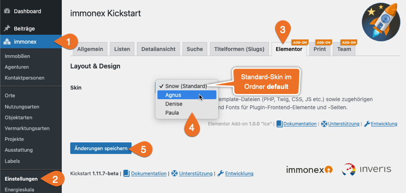

# Skins

Ein *Skin* ist – ähnlich eines WordPress-Themes – ein Ordner, der alle für die Darstellung der **Frontend-Komponenten** des Plugins benötigten Vorlagen und Ressourcen enthält:

- Templates (PHP/[Twig](https://twig.symfony.com/))
- JavaScript-Dateien
- CSS-Dateien
- Bilddateien
- Fonts etc.

Im **Plugin-Verzeichnis** des Elementor-Add-ons ist ein *Standard-Skin* im Unterordner `skins/default` enthalten:

<pre class="tree">
<strong>…/wp-content/plugins</strong>
╷
├── <strong>/immonex-kickstart-elementor</strong> ← <em class="token important">Plugin-Verzeichnis</em>
│   ╷
│   └─ /skins
│      ╷
│      ├─ <span class="token important">/default</span> ← Standard-Skin
│      …
…
</pre>

Der passende Ort für *update-sichere* [Anpassungen](#individuelle-anpassung) oder [Custom Skins](#custom-skins) ist ein Unterordner im **Child-Theme-Verzeichnis**:

`…/wp-content/themes/<child-theme-name>/immonex-kickstart-elementor/<skin-name>`

?> Mit dem sog. [nativen Widgets](#elementor-immobilien-widgets) werden Frontend-Komponenten anderer, sog. *Parent-Plugins* eingebunden, deren Vorlagen in den Skin-Ordnern eben dieser Plugins enthalten sind, **nicht** im o. g. Skin-Ordner des Elementor-Add-ons.

## Auswahl



Skin-Auswahl unter ***immonex → Einstellungen → Elementor <sup>ADD-ON</sup>***

Die Ordnerstruktur könnte in diesem Beispiel so aussehen:

<pre class="tree">
<strong>…/wp-content/plugins/immonex-kickstart-elementor/skins</strong>
╷
└── <span class="token important">/default</span> ← Standard-Skin "Snow"

<strong>…/wp-content/themes/<child-theme-name>immonex-kickstart-elementor</strong>
╷
├── <span class="token important">/agnus</span> ← Custom Skin "Agnus"
├── <span class="token important">/denise</span> ← Custom Skin "Denise"
└── <span class="token important">/paula</span> ← Custom Skin "Paula"
</pre>

?> Die Ordnernamen sind unabhängig vom eigentlichen (angezeigten) Skin-Namen, der in der Datei `index.php` festgelegt wird (siehe unten).

## Aufbau

Der grundlegende Aufbau eines Kickstart- bzw. Add-on-Skins ist denkbar einfach:

<pre class="tree">
skin-name
╷
├── /css
│   ╷
│   └── index.css
│
├── /js
│   ╷
│   └── index.js
│
└── index.php
</pre>

Die Datei `index.php` enthält nur den Namen des (Add-on-)Skins für die Ausgabe:

```php
<?php
/**
 * Skin Name: Snow
 */

die( "Don't event think about it!" );
```

Die Dateien `index.css` und `index.js` des **aktiven** Skins werden im Frontend automatisch eingebunden. Das gilt auch für weitere Dateien mit den folgenden Namen, sofern vorhanden:

- `extend.css` / `extend.js`
- `custom.css` / `custom.js`
- `frontend.css` / `frontend.js`
- `skin.css` / `skin.js`

Je nach Umfang bietet es sich an, bei der **Entwicklung** mit mehreren Quelldateien zu arbeiten, die anschließend per Bundler bzw. Präprozessor à la [webpack](https://webpack.js.org/), [Sass](https://sass-lang.com/) & Co. kompiliert werden. Die *kompilierten und/oder minimierten* Varianten der Dateien sollten in diesem Fall im **alternativen** Ordner `assets` (anstatt `css` und `js`) gespeichert werden:

<pre class="tree">
skin-name
╷
├── /assets
│   ╷
│   ├── index.css
│   └── index.js
…
</pre>

Auch hier ist eine Aufteilung der CSS- und JS-Dateien in separate Unterordner möglich:

<pre class="tree">
skin-name
╷
├── /assets
│   ╷
│   ├── /css
│   │   ╷
│   │   ├── index.css
│   │   ├── custom.css
│   │   …
│   └── /js
│       ╷
│       ├── index.js
│       ├── extend.js
…       …
</pre>

Jede der o. g. CSS/JSS-Dateien wird nur **einmalig** eingebunden. Sind mehrere Dateien gleichen Namens im Skin-Ordner enthalten, erfolgt die entsprechende Priorisierung anhand der **Unterordner** in dieser Reihenfolge:

- `assets/css/` / `assets/js/`
- `assets/`
- `css/` / `js/`

Ist also bspw. eine Datei `custom.css` in den Unterordnern `assets` **und** `css` enthalten, wird nur die Variante im Ordner `assets` im Website-Frontend geladen.

## Individuelle Anpassung

Skins bilden auch die Grundlage für weitergehende Modifikationen, die mit den Konfigurationsmöglichkeiten innerhalb des Elementor-Editors oder per [CSS](css) etc. nicht umsetzbar sind. Hierbei kann entweder ein mitgeliefertes Skin *partiell* angepasst oder ein ganz individuelles *Custom Skin* erstellt werden.

In beiden Fällen erfolgt die **update-sichere** Bereitstellung im **Child-Theme-Verzeichnis** nach folgendem Ordnerschema:

`…/wp-content/themes/<child-theme-name>/<plugin-name>/<skin-name>`

Beispielstruktur:

<pre class="tree">
<strong>…/wp-content/themes</strong>
╷
├── /my-immo-theme
├── <strong>/my-immo-child-theme</strong> ← Child-Theme-Ordner
│   ╷
│   └─ <strong>/immonex-kickstart-elementor</strong> ← Custom Skins für das Kickstart-Elementor-Add-on
│      ╷
│      ├─ <span class="token important">/default</span> ← angepasste Dateien des <em class="token important">Standard-Skins</em>
│      └─ <span class="token important">/my-skin</span> ← <em class="token important">individuelles Custom Skin</em>
…
</pre>

### Partielle Anpassung

Sollen nur bestimmte Elemente eines mitgelieferten Skins – im Regelfall des *Standard-Skins* – angepasst werden, muss im betreffenden **Child-Theme-Unterordner** ein gleichnamiger Ordner (beim Standard-Skin also `default`) angelegt werden, der nur die **geänderten Dateien** enthält.

Sollen bspw. nur eigene Varianten der Dateien `index.css` und `detail-list.twig` (Immobilien-Detailansicht-Widget) eingebunden, alles andere aber weiterhin aus dem Standard-Skin-Ordner übernommen werden, ergibt sich die folgende Struktur:

#### Standard-Skin-Ordner (Plugin-Verzeichnis)

<pre class="tree">
<strong>…/wp-content/plugins</strong>
╷
├── <strong>/immonex-kickstart-elementor</strong>
│   ╷
│   └─ <strong>/skins</strong>
│      ╷
│      └─ <span class="token important">/default</span>
│         ╷
│         ├─ /assets
│         │  ╷
│         │  ├─ <span class="token important">index.css</span>
│         │  └─ index.js
│         │
│         ├─ /widgets
│         │  ╷
│         │  └─ /single-property
│         │     ╷
│         │     ├─ <span class="token important">detail-list.twig</span>
…         …     …
</pre>

#### Skin-Ordner mit angepassten Dateien (Child-Theme-Verzeichnis)

<pre class="tree">
<strong>…/wp-content/themes/&lt;child-theme-name&gt;</strong>
╷
├── <strong>/immonex-kickstart-elementor</strong>
│   ╷
│   └─ <span class="token important">/default</span>
│      ╷
│      ├─ /assets
│      │  ╷
│      │  └─ <span class="token important">index.css</span>
│      │
│      └─ /widgets
│         ╷
│         └─ /single-property
│            ╷
│            └─ <span class="token important">detail-list.twig</span>
…
</pre>

### Custom Skins

Sollen umfangreichere Anpassungen oder eine ganz individuelle Form der Darstellung umgesetzt werden, ist ein vollständig benutzerdefiniertes *Custom Skin* die passende Wahl, das **alle** benötigten Dateien enthält und unter einem eigenen Namen unabhängig von den im Plugin enthaltenen Skins entwickelt wird.

Als Basis hierfür kann eine Kopie des Standard-Skins angelegt werden, die dann schrittweise angepasst wird.

<pre class="tree">
<strong>…/wp-content/themes</strong>
╷
├── /my-immo-theme
├── <strong>/my-immo-child-theme</strong>
│   ╷
│   └─ <strong>/immonex-kickstart-elementor</strong>
│      ╷
│      └─ <span class="token important">/fichtenelch</span> ← <em class="token important">Custom Skin "Fichtenelch"</em>
…
</pre>

Die Vorgehensweise entspricht der der Entwicklung von [Custom Skins für das Kickstart-Basis-Plugin](https://docs.immonex.de/kickstart/#/anpassung-erweiterung/skins?id=komplett).

### Elementor-Immobilien-Widgets

Eine Besonderheit der Elementor-Add-on-Skins stellt die Unterscheidung zwischen *regulären* und *nativen* [Widgets](/elementor-immobilien-widgets/einleitung) dar: Nur die im Skin-Unterordner `widgets` enthaltenen Vorlagen der **regulären** Varianten – meist eine PHP-Datei für die Editor-Vorschauversion und ein Twig-Template für den eigentlichen Frontend-Output – sind relevant, wenn es um individuelle Anpassungen geht.

Die Vorlagen der *nativen* Komponenten hingegen sind Bestandteile der Skins der sog. *Parent-Plugins*, zu denen sie gehören, sprich, die deren *Ausgabe generieren*. Soll also die Frontend-Darstellung eines nativen Widgets grundlegend verändert werden, werden die angepassten Template-Dateien im jeweiligen Child-Theme-Unterordner des Parent-Plugins hinterlegt.

Beispiel: Die Ausgabe des nativen Widgets ***Standard-Header*** wird normalerweise auf Basis einer Vorlagendatei gerendert, die Teil des Standard-Skins des **Kickstart-Basisplugins** ist ...

`…/wp-content/plugins/immonex-kickstart/skins/default/single-property/head.php`

... und dementsprechend mit einer angepassten Datei gleichen Namens im folgenden Child-Theme-Unterordner *überschrieben* werden kann:

`…/wp-content/themes/<child-theme-name>/immonex-kickstart/default/single-property/head.php`

!> Im Gegensatz zu den regulären Widgets wirken sich Änderungen in den Template-Dateien nativer Frontend-Elemente auch auf anderweitige, von Elementor unabhängige Formen der Einbindung aus (bspw. per Shortcode).

<pre class="tree">
skin-name
…
╷
├── <span class="token important">/widgets</span>
│   ╷
│   ├── /property-list ← (optionale) Templates nativer Immobilien-Listen-Widgets
│   │   ╷
│   │   ├── native-filters-sort.twig
│   │   ├── native-pagination.twig
│   │   ├── native-property-carousel.twig
│   │   ├── native-property-list.twig
│   │   ├── native-property-map.twig
│   │   └── native-search-form.twig
│   │
│   ├── <span class="token important">/single-property</span> <em class="token important">← Templates für Widgets der Immobilien-Detailansicht</em>
│   │   ╷
│   │   ├── areas-preview.php ← Vorschau-Template (PHP)
│   │   ├── areas.twig ← Frontend-Template (Twig)
│   │   ├── basic-gallery.twig
│   │   ├── condition-preview.php
│   │   ├── condition.twig
│   │   ├── core-details-preview.php
│   │   ├── core-details.twig
│   │   …
│   ├── /team ← (optionale) Templates nativer Team-Add-on-Widgets
│   │   ╷
│   │   ├── native-agency-list.twig
│   │   ├── native-agency.twig
│   │   ├── native-agent-list.twig
│   │   └── native-agent.twig
│   │
│   ├── /lead-generator ← (optionale) Templates nativer Lead-Generator-Widgets
│   ├── /notify ← (optionale) Templates nativer Notify-Widgets
│   │
│   └── <span class="token important">native-default.twig</span> ← <em class="token important">Fallback-Template für alle nativen Widgets ohne dedizierte Vorlagendatei</em>
… 
</pre>

Die Ordner `/widgets/property-list`, `/widgets/team`, `/widgets/lead-generator` und `/widgets/notify` enthalten aktuell nur Twig-Vorlagen der zugehörigen *nativen* Widgets für Immobilien-Listenansichten und die Komponenten des [Team-Add-ons](https://de.wordpress.org/plugins/immonex-kickstart-team/).

Auch im Ordner `/widgets/single-property` sind einige Templates für native Komponenten enthalten – auch hier am `native-` am Anfang des Dateinamens zu erkennen.

> Wie jetzt? Es gibt also doch Templates für **native** Widgets im **Elementor-Add-on-Skin-Ordner**? 🤔

Formal gesehen ja, diese sind allerdings **optional** und enthalten lediglich einen Platzhalter ([Twig-Variable](https://twig.symfony.com/doc/3.x/templates.html/)) für die hierüber einzufügenden *Shortcode-Inhalte* der Parent-Plugins. Gleiches gilt für die Datei `native-default.twig` die als *Fallback-Template* für alle nativen Widgets verwendet wird, für die keine dedizierte Vorlagendatei vorhanden ist.

Ergo: Die eigentlichen Inhalte der nativen Elemente können in diesen Templates nicht verändert werden, es ist aber möglich, bei Bedarf etwas davor und/oder dahinter einzufügen.

## Hier geht's weiter &#8811; <!-- {docsify-ignore} -->

- [Mehrsprachigkeit & Übersetzungen](uebersetzung-mehrsprachigkeit)