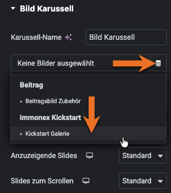
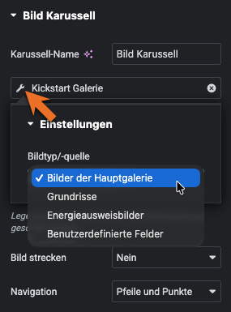

# Galerie

Dieser *Dynamic Tag* ermöglicht in Vorlagen für [Immobilien-Detailseiten](https://docs.immonex.de/kickstart/#/komponenten/detailansicht) die Einbindung von objektbezogenem Bildmaterial über *Steuerelemente* ([Controls](https://developers.elementor.com/docs/controls/)), die dynamische Daten der [Kategorie `gallery`](https://developers.elementor.com/docs/dynamic-tags/dynamic-tags-categories/) unterstützen.

Das sind Auswahlelemente, die z. B. in den Einstellungen der folgenden Widgets enthalten sind:

- ***Allgemein*** › ***Basisgalerie***
- ***Allgemein*** › ***Bild Karussell***
- ***Pro*** › ***Galerie***

In den Optionen des Galerie-Tags kann der Bildtyp bzw. die Bildquelle festgelegt werden:

- Hauptgalerie-Bilder (Außen- und Innenansichten, Objekt-Detailfotos, Illustrationen etc.)
- Grundrisse und Lagepläne
- Energieausweis-Grafiken (Energieskalen/Diagramme, Energieausweis-Scans)
- *Benutzerdefinierte Felder*

Bei Auswahl letzterer Option können in einem zusätzlichen Eingabefeld (kommagetrennt) die **Namen** der benutzerdefinierten Felder (*Custom Fields*) hinterlegt werden, die die IDs der einzubindenden Bilder (Medienanhang-Beiträge) – wiederum in Form kommagetrennter Listen – enthalten.

## Siehe auch <!-- {docsify-ignore} -->

- Widget: [Basisgalerie](../elementor-immobilien-widgets/basisgalerie)
- Widget: [Galerie 🄽](../elementor-immobilien-widgets/galerie) (*native* Kickstart-Galerie inkl. Thumbnail-Navigationsleiste)

