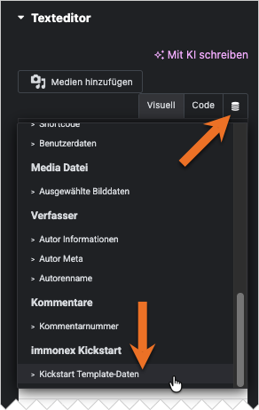
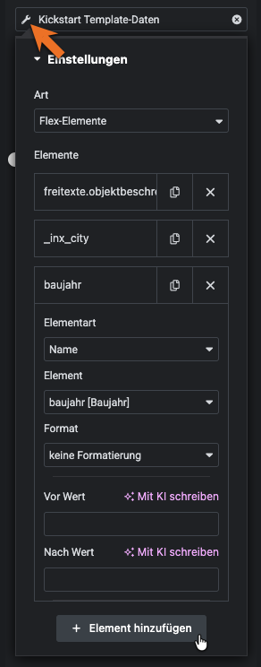

# Template-Daten

Dieser *Dynamic Tag* ermöglicht in Vorlagen für [Immobilien-Detailseiten](https://docs.immonex.de/kickstart/#/komponenten/detailansicht) die Einbindung von Textinhalten über *Steuerelemente* ([Controls](https://developers.elementor.com/docs/controls/)), die dynamische Daten der [Kategorie `text`](https://developers.elementor.com/docs/dynamic-tags/dynamic-tags-categories/) unterstützen.

Das sind Eingabefelder, die z. B. in den Einstellungen der folgenden Widgets enthalten sind:

- ***Grundlegend*** › ***Überschrift***
- ***Grundlegend*** › ***Texteditor***
- ***Allgemein*** › ***HTML***

Analog zum [Flex-Details-Widget](/elementor-immobilien-widgets/flex-details) können beliebig viele *Template-Daten-Elemente* ausgewählt werden. (Die alternative Art *Array-Schlüssel* ist nur aus Kompatibilitätsgründen mit älteren Plugin-Versionen vorhanden und daher nicht mehr aktuell.)

Wie beim Widget basiert die Auswahl - mit Ausnahme von *Mapping-Gruppen* – auch hier auf der *Elementart*, sprich den zuhehörigen Angaben in den Spalten *Name*, *Group* und *Destination* der [Mapping-Tabelle](https://docs.immonex.de/openimmo2wp/#/mapping/tabellen). Auch die Formatierungsmöglichkeiten sind hier identisch.

Werden mehrere Elemente ausgewählt, werden die Inhalte im Frontend **ohne** umschließende Listen- oder Container-Elemente direkt nacheinander ausgegeben.

Bei jedem Element besteht die Möglichkeit, dem eigentlichen Elementwert einen Text voranzustellen oder anzuhängen. In diesen Eingabefeldern können auch HTML-Codes für einfache Formatierungen oder Zeilenumbrüche verwendet werden, Beispiel:

*Vor Wert*: `<strong>Baujahr:</strong>`  
*Nach Wert*: ` `

Ist das einzubindende Element bei einer Immobilie nicht vorhanden oder leer, werden auch die Vor/Nach-Inhalte im Frontend **nicht** angezeigt.

Die variablen Inhaltsarten werden in der **Vorschau** des Elementor-Editors nicht berücksichtigt, stattdessen werden Platzhalter wie `[elementart: name]` angezeigt.

## Siehe auch <!-- {docsify-ignore} -->

- Widget: [Flex-Details](/elementor-immobilien-widgets/flex-details)
- [Import von OpenImmo-Immobiliendaten in WordPress-Sites](https://docs.immonex.de/kickstart/#/schnellstart/import)
- [Mapping-Tabellen](https://docs.immonex.de/openimmo2wp/#/mapping/tabellen) (immonex OpenImmo2WP)

