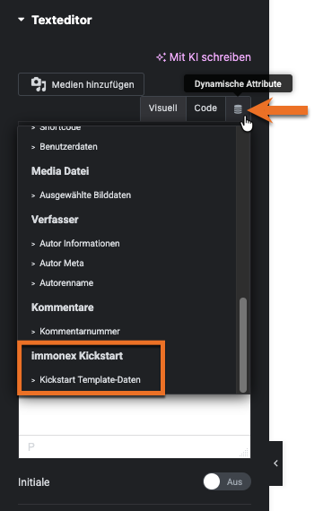

# Dynamische Inhalte

Beim Einsatz von [Elementor Pro](https://be.elementor.com/visit/?bta=229006&nci=5657) können neben den vom Kickstart-Elementor-Add-on bereitgestellten Komponenten auch **Elementor-Standard-Widgets** für die Ausgabe *dynamischer Immobilien-Inhalte* genutzt werden, wenn diese kompatible *Steuerelemente* ([Controls](https://developers.elementor.com/docs/controls/)) enthalten.

Beispiel: Die Eingabefelder der *Texteditor-* und *Überschrift-Widgets* erlauben neben der direkten Eingabe den Abruf von Inhalten aus alternativen Quellen. Hierzu gehören die Daten des aktuellen Immobilienangebots, die anhand der Angaben in der für den OpenImmo-Import verwendeten [Mapping-Tabelle](https://docs.immonex.de/openimmo2wp/#/mapping/tabellen) ausgewählt werden können.

Hierfür werden vom Add-on die folgenden [Dynamic Tags](https://elementor.com/help/dynamic-tags-pro/) (dynamische Platzhalter) für die Verwendung in [Immobilien-Detailseiten](https://docs.immonex.de/kickstart/#/komponenten/detailansicht) registriert:

- [Template-Daten](template-daten) (diverse Immobilien-Detailinhalte)
- [Galerie](galerie) (Objektfotos/Illustrationen, Grundrisse, Energieausweis-Bilddateien)

## Siehe auch <!-- {docsify-ignore} -->

- [Dynamic Tags](https://developers.elementor.com/docs/dynamic-tags/) (Elementor-Entwickler-Dokumentation)
- [Dynamische Inhalte](https://elementor.com/de/funktionen/dynamic-content/) (Elementor-Feature-Übersicht)