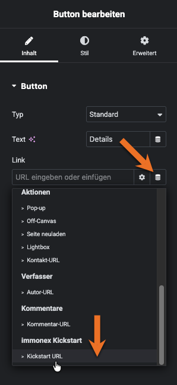
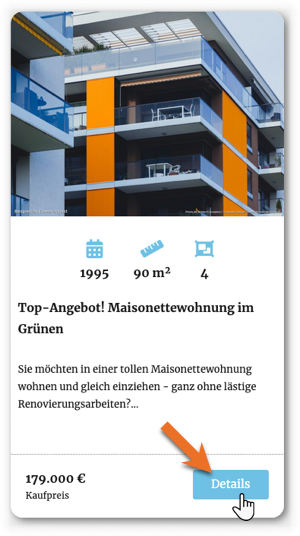
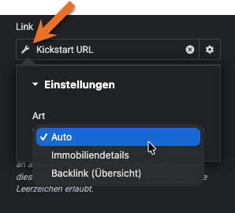
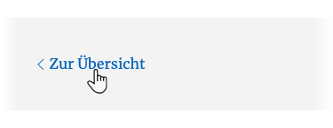

# URL

In Immobilien-Listenansichten auf Basis von [Loop-Grid-](https://elementor.com/help/loop-grid/) oder [Loop-Karussell-Widgets](https://elementor.com/help/loop-carousel/) werden typischerweise die jeweiligen Objekt-Detailseiten verlinkt.

Damit in diesen wiederum auf die korrekte Ausgangsseite verwiesen werden kann, sollte für die Generierung der URLs **auf beiden Seiten** auf diesen Dynamic Tag zurückgegriffen werden.

Die Art der URL kann im Regelfall automatisch ermittelt werden, bei Bedarf ist aber auch eine explizite Auswahl möglich:

*Immobiliendetails* in Übersichtsseiten (Listen), *Backlink (Übersicht)* in Detailseiten.

In Übersichtsseiten wird den Detailseiten-*Permalinks* ein *Backlink*-Parameter mit der Rücksprung-URL angehangen. Ist neben dem Loop-Element bspw. auch ein [Immobilien-Suchformular](/elementor-immobilien-widgets/suchformular) in der Seite enthalten, enhält die Backlink-URL zudem die jeweiligen Suchkriterien in Form von *GET-Parametern*.

Diese Backlink-URL wird in den Objekt-Detailseiten für die *Zurück-Links* übernommen.

