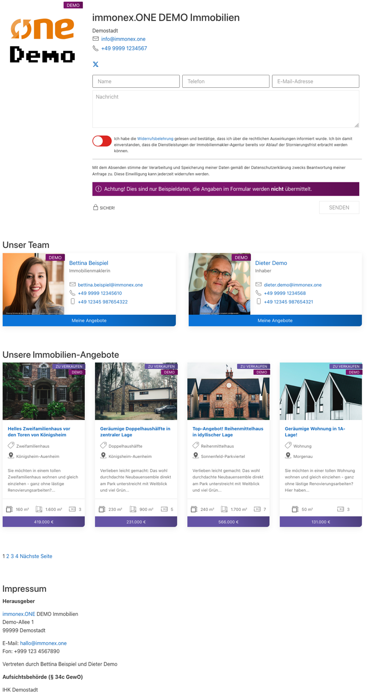

# Agentur

## Beispiel (Vollansicht)

## Widget-Details

[Skin](/anpassung-erweiterung/skins)-Templates (Parent Plugin):  
`single-agency/index.php` (Vollansicht)  
`single-agency/widget.php` (Widget-Ansicht)  

---

Dieses Widget ermöglicht die Einbindung eines *Agenturprofils* – sowohl in Vorlageseiten/Templates von Immobilien-Detailseiten (→ Darstellungsart *Widget*) als auch in dedizierten Agentur-Detailseiten (→ *Vollansicht*).

Der Umfang ist variabel: Die kompaktere Widget-Ansicht enthält alle Agentur-Kontaktdaten inkl. Logo und Formular. Die Vollansicht umfasst (optional) zusätzlich Listen zugehöriger Kontaktpersonen und Immobilien sowie ein Impressum.

Bei der Einbindung innerhalb einer Immobilien-Detailseiten-Vorlage wird die zugehörige Agentur automatisch ermittelt.

?> Das [Kontaktpersonen-Widget](kontaktperson-formular) ist die gängigere Variante der Kontaktdaten-Einbindung in **Immobilien-Detailseiten**.

Soll hinsichtlich der anzuzeigenden Elemente **nicht** der jeweilige Standardumfang der gewählten Darstellungsart übernommen werden, kann via ***Kontakt-Elemente*** eine individuelle Auswahl getroffen werden.

Beim Kontaktformular kann zwischen einer einfachen (Name, Telefon, E-Mail-Adresse, Nachricht) und einer erweiterten Variante (inkl. Anrede und zusätzlichen Pflichtfeldern für Vor- und Nachname sowie die Adresse) gewählt werden. Bei Auswahl von *Standard* wird die entsprechende [Vorgabe der Kickstart-Team-Plugin-Optionen](https://docs.immonex.de/kickstart-team/#/schnellstart/einrichtung?id=kontaktformular) übernommen, was auch für diverse weitere Optionen mit dieser Auswahlmöglichkeit gilt.

## Siehe auch

- Widget: [Kontaktperson/-formular 🄽](kontaktperson-formular)
- [Agentur-Details](https://docs.immonex.de/kickstart-team/#/komponenten/agentur-details) (immonex Kickstart Team)
- Plugin: [immonex Kickstart Team](https://de.wordpress.org/plugins/immonex-kickstart-team/) (→ [Dokumentation](https://docs.immonex.de/kickstart-team/))

