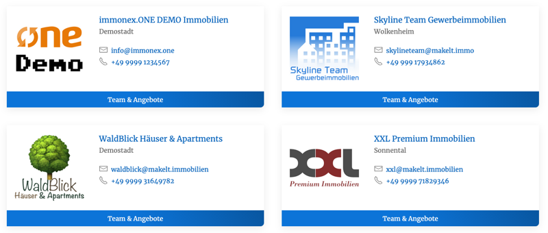

# Agenturliste

## Beispielansicht

## Widget-Details

[Skin](/anpassung-erweiterung/skins)-Templates (Parent Plugin):  
`agency-list/index.php`  
`agency-list/item.php`

---

Mit diesem Widget können Listenansichten von Immobilienmakler-Agenturen (Beitragsart `inx_agency`) im Raster/Grid-Layout eingebunden werden.

Die Einstellungen entsprechen weitestgehend den Attributen des entsprechenden [Kickstart-Team-Shortcodes](https://docs.immonex.de/kickstart-team/#/komponenten/agentur-listen?id=shortcode) `[inx-team-agency-list]`.

?> Im Gegensatz zu den Immobilienlisten ist hier keine Seitennavigation verfügbar. Stattdessen wird ggf. ein Link zur *Archivseite* der Beitragsart angezeigt, sofern diese nicht in den Plugin-Optionen deaktiviert wurde **und** in den Widget-Optionen ein ***Seitenlimit*** festgelegt ist. 

## Siehe auch

- [Agenturlisten](https://docs.immonex.de/kickstart-team/#/komponenten/agentur-listen) (immonex Kickstart Team)
- [Beitragsarten](https://docs.immonex.de/kickstart-team/#/beitragsarten) (immonex Kickstart Team)
- Plugin: [immonex Kickstart Team](https://de.wordpress.org/plugins/immonex-kickstart-team/) (→ [Dokumentation](https://docs.immonex.de/kickstart-team/))

