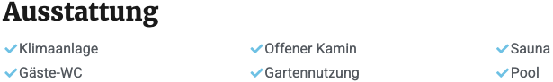
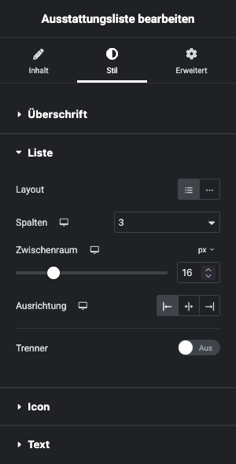
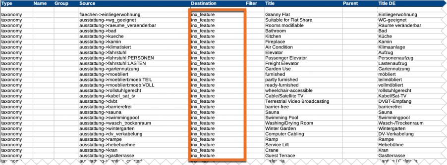

# Ausstattungsliste

## Beispielansicht

## Widget-Details

[Skin](/anpassung-erweiterung/skins)-Templates:  
`widgets/single-property/feature-list.twig` (Frontend)  
`widgets/single-property/feature-list-preview.php` (Editor-Vorschau)

---

Mit diesem Widget können Ausstattungsmerkmale – *Terms* der *Ausstattungs-Taxonomie* – in Listenform eingebunden werden. Hierbei können – analog zu den meisten anderen Widgets – alle Elemente (Spaltenlayout, Überschrift, Icon, Text etc.) individuell gestaltet werden.

Die Zuweisung erfolgt anhand der Einträge des Typs `taxonomy` (Spalte ***Type***) mit dem Ziel `inx_feature` (Spalte ***Destination***) in der [Mapping-Tabelle](https://docs.immonex.de/openimmo2wp/#/mapping/tabellen), die beim [Immobilien-Import mit immonex OpenImmo2WP](https://plugins.inveris.de/wordpress-plugins/immonex-openimmo2wp) zum Einsatz kommt.

## Siehe auch

- [Beitragsarten und Taxonomien](https://docs.immonex.de/kickstart/#/beitragsarten-taxonomien) (immonex Kickstart)
- [Import von OpenImmo-Immobiliendaten in WordPress-Sites](https://docs.immonex.de/kickstart/#/schnellstart/import)
- [Mapping-Tabellen](https://docs.immonex.de/openimmo2wp/#/mapping/tabellen) (immonex OpenImmo2WP)

