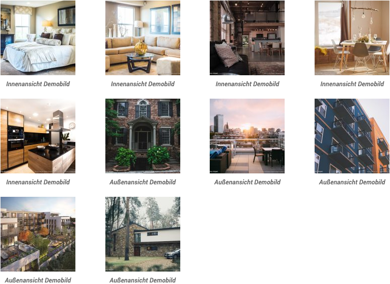
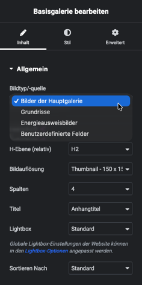

# Basisgalerie

## Beispielansicht

## Widget-Details

[Skin](/anpassung-erweiterung/skins)-Template:  
`widgets/single-property/basic-gallery.twig`

---

Die Möglichkeiten der Basisgalerie für Kickstart-Inhalte entsprechen weitgehend denen des gleichnamigen Elementor-Widgets, werden hier aber – analog zum nativen [Galerie-Widget](galerie) – noch durch die Auswahl einer *immobilienspezifischen* Bildquelle ergänzt:

- Hauptgalerie (Außen- und Innenansichten, Objekt-Detailfotos, Illustrationen etc.)
- Grundrisse und Lagepläne
- Energieausweisbilder/-dokumente
- *Benutzerdefinierte Felder*

Bei Auswahl letzterer Option können in einem zusätzlichen Eingabefeld (kommagetrennt) die **Namen** der benutzerdefinierten Felder (*Custom Fields*) hinterlegt werden, die die IDs der einzubindenden Bilder/PDF-Dateien (Medienanhang-Beiträge) – wiederum in Form kommagetrennter Listen – enthalten.

?> Beim Einsatz von **Elementor Pro** können Galerie-Inhalte alternativ auch mit **Elementor-Standard-Widgets** eingebunden werden, die den [*Dynamic Tag* Galerie](../elementor-immobilien-dynamic-tags/galerie) unterstützen.

## Siehe auch

- Widget: [Galerie 🄽](galerie) (*native* Kickstart-Galerie inkl. Thumbnail-Navigationsleiste)
- Dynamic Tag: [Galerie](../elementor-immobilien-dynamic-tags/galerie)

