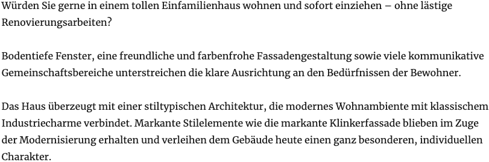
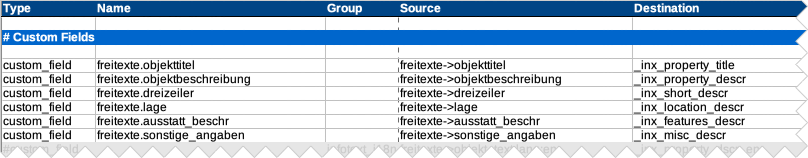

# Beschreibung

## Beispielansicht

## Widget-Details

[Skin](/anpassung-erweiterung/skins)-Templates:  
`widgets/single-property/desc.twig` (Frontend)  
`widgets/single-property/desc-preview.php` (Editor-Vorschau)

---

Mit diesem Widget können die folgenden **Immobilien-Beschreibungstexte** separat eingebunden werden:

- primäre Objektbeschreibung
- Lage
- Ausstattung
- Sonstiges

Die Zuweisung erfolgt anhand der *Freitext-Einträge* in der [Mapping-Tabelle](https://docs.immonex.de/openimmo2wp/#/mapping/tabellen), die beim [Immobilien-Import mit immonex OpenImmo2WP](https://plugins.inveris.de/wordpress-plugins/immonex-openimmo2wp) zum Einsatz kommt.

## Siehe auch

- [Import von OpenImmo-Immobiliendaten in WordPress-Sites](https://docs.immonex.de/kickstart/#/schnellstart/import)
- [Mapping-Tabellen](https://docs.immonex.de/openimmo2wp/#/mapping/tabellen) (immonex OpenImmo2WP)

