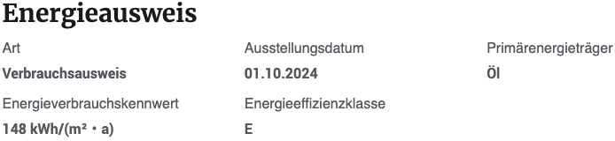

# Energieausweis

## Beispielansicht

## Widget-Details

[Skin](/anpassung-erweiterung/skins)-Templates:  
`widgets/single-property/epass.twig` (Frontend)  
`widgets/single-property/epass-preview.php` (Editor-Vorschau)

---

Die Auswahl der Energieangaben, die mit diesem Widget **in Listenform** eingebunden werden, erfolgt anhand der *Mapping-Gruppe* `epass`.

Ist das Zusatzplugin [immonex Energy Scale Pro](https://plugins.inveris.de/shop/immonex-energy-scale-pro/) im Einsatz, können diese mit dem entsprechenden [Energieskalen-Widget](energieskala) durch eine grafische Visualisierung der Energieklasse ergänzt werden.

Ebenso besteht die Möglichkeit, mit den Objekten übermittelte Energieausweis-Bilder oder PDF-Dokumente per [Galerie-Widget](galerie) oder [Basisgalerie](basisgalerie) einzubinden.

## Siehe auch

- Widget: [Energieskala 🄽](energieskala)
- Widget: [Galerie 🄽](galerie) (Energieausweis-Bild- und PDF-Anhänge)
- Widget: [Basisgalerie](basisgalerie) (Energieausweis-Bild- und PDF-Anhänge)
- Plugin: [immonex Energy Scale Pro](https://plugins.inveris.de/shop/immonex-energy-scale-pro/) (→ [Dokumentation](https://docs.immonex.de/energy-scale-pro/))

