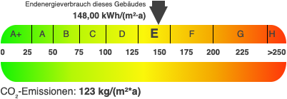
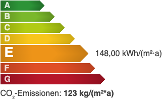

# Energieskala

## Beispielansichten

### Bandtacho-Darstellung

### Farbbalken-Darstellung

## Widget-Details

[Skin](/anpassung-erweiterung/skins)-Templates (Parent Plugin):  
`bandtacho.php` / `bandtacho.css` (*Bandtacho*-Darstellung wie in deutschen Energieausweisen)  
`stacked_bars.php` / `stacked_bars.css` (*Farbbalken*-Darstellung)

---

Ist das [Energy-Scale-Pro-Plugin](https://plugins.inveris.de/shop/immonex-energy-scale-pro/) installiert und aktiv, können mit diesem Widget bspw. die [Energieausweisdaten im Textformat](energieausweis) durch eine grafische Darstellung der Energieeffizienzklasse und der zugehörigen Kennwerte gemäß Energieeinsparverordnung (EnEV) bzw. Gebäudeenergiegesetz (GEG) ergänzt werden.

## Siehe auch

- Widget: [Energieausweis](energieausweis) (Energiedaten in Listenform)
- Widget: [Galerie 🄽](galerie) (Energieausweis-Bild- und PDF-Anhänge)
- Plugin: [immonex Energy Scale Pro](https://plugins.inveris.de/shop/immonex-energy-scale-pro/) (→ [Dokumentation](https://docs.immonex.de/energy-scale-pro/))

