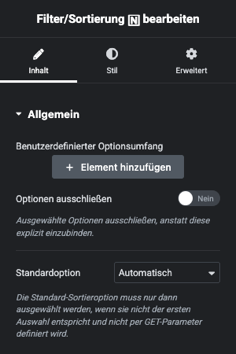

# Filter/Sortierung

## Beispielansicht

## Widget-Details

[Skin](/anpassung-erweiterung/skins)-Template (Parent Plugin): `property-list/filters-sort.php`

---

Das Sortierungs-Widget wird üblicherweise oberhalb einer [Listenansicht](liste-grid) eingefügt. Die Ausgabe entspricht der des Kickstart-Shortcodes `[inx-filters-sort]`.

Die Auswahloptionen können bei Bedarf in den Widget-Einstellungen festgelegt werden. Ist das nicht der Fall, werden die gängigen Standardvorgaben übernommen.

---

### Siehe auch

- Widget: [Liste (Grid) 🄽](liste-grid)
- Widget: [Seitennavigation 🄽](seitennavigation)
- [Sortierung](https://docs.immonex.de/kickstart/#/komponenten/sortierung) (immonex Kickstart)

