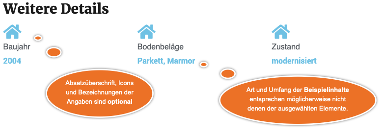
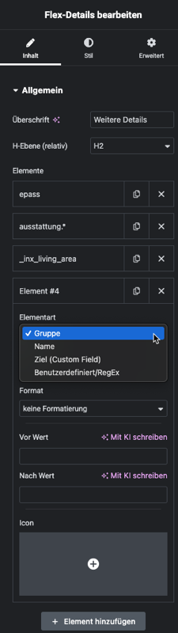

# Flex-Details

## Beispielansichten

### Layout mit Icons

### Kompakteres Alternativlayout

## Widget-Details

[Skin](/anpassung-erweiterung/skins)-Templates:  
`widgets/single-property/detail-list.twig` (Frontend)  
`widgets/single-property/detail-list-preview.php` (Editor-Vorschau)

---

Mit dem Flex-Details-Widget kann eine Liste **beliebiger Immobilien-Detaildaten** erstellt werden.

Mit jedem in den Widget-Optionen definierten Listenelement können sowohl einzelne Werte als auch *Gruppen* eingebunden werden, die mehrere Angaben enthalten.

Nach dem Hinzufügen eines Elements wird der Umfang mit den Listen bzw. Eingabefeldern ***Elementart*** und ***Element*** definiert. Grundlage hierfür ist die [Mapping-Tabelle](https://docs.immonex.de/openimmo2wp/#/mapping/tabellen), die für den **OpenImmo-XML-basierten Import** mit [immonex OpenImmo2WP](https://plugins.inveris.de/wordpress-plugins/immonex-openimmo2wp) eingesetzt wird.

Die ausgewählte Elementart bezieht sich – mit Ausnahme der benutzerdefinierten Variante – auf die Inhalte einer bestimmten Spalte der Mapping-Tabelle:

| Elementart              | Tabellenspalte(n) |
| ----------------------- | ----------------- |
| Gruppe                  | Group             |
| Name                    | Name              |
| Ziel (Custom Field)     | Destination       |
| Benutzerdefiniert/RegEx | Group und Name    |

Beispiel: Wird die *Gruppe* `flaechen` ausgewählt, werden im Frontend alle Daten der betr. Immobilie angezeigt, bei denen in der Spalte ***Group*** diese Bezeichnung hinterlegt ist.

Einzelangaben (mit der jeweiligen Bezeichnung in eckigen Klammern) können über die Spalte ***Name*** referenziert werden (z. B. `baujahr [Baujahr]`).

Die Zusatzangabe *(diverse)* bezieht sich auf Mapping-Einträge, mit denen beim Import entweder ...

- mehrere OpenImmo-Werte in **einer Zeichenkette** kombiniert werden (bspw. "Badausstattung: *Dusche, Badewanne*" bei `ausstattung.bad (diverse)`)
- oder einem *Mapping-Namen* mehrere gleichartige Werte zugewiesen werden, wobei nur der für die jeweilige Immobilienart relevanteste übernommen wird.

Die Auswahl einer Datengruppe – erkennbar am `*` – ist via *Name* ebenfalls möglich, d. h. analog zum vorherigen Beispiel würde `flaechen.*` das gleiche Ergebnis liefern.

Mit der Elementart *Ziel* können Daten auf Basis des *Custom Fields* eingebunden werden, in dem sie beim Import per Zuordnung über die Spalte ***Destination*** gespeichert werden. Beispiel *Wohnfläche*: `_inx_living_area`

Darüber hinaus können mit *benutzerdefinierten* Zeichenketten oder [regulären Ausdrücken (RegEx)](https://de.wikipedia.org/wiki/Regul%C3%A4rer_Ausdruck) auch beliebige Inhalte der Spalten ***Group*** und ***Name*** bei der Filterung der auszugebenden Objektdaten berücksichtigt werden. Ein RegEx-Ausdruck muss hierbei mit `/` beginnen und enden.

Handelt es sich bei den Elementwerten um reine Zahlen (z. B. Flächen- oder Preisangaben), URLs oder Mailadressen, kann unter *Format* die entsprechende Formatierungsart eingestellt werden. (Andernfalls wird *Rohwert* eingebunden, was in den meisten Fällen unpassend ist.)

?> Eine ähnliche Art der Einbindung **ohne Listen-Layout** kann mittels **Elementor-Standard-Widgets** umgesetzt werden, die den [*Dynamic Tag* Template-Daten](/elementor-immobilien-dynamic-tags/template-daten) unterstützen.

## Siehe auch

- Dynamic Tag: [Template-Daten](/elementor-immobilien-dynamic-tags/template-daten)
- [Import von OpenImmo-Immobiliendaten in WordPress-Sites](https://docs.immonex.de/kickstart/#/schnellstart/import)
- [Mapping-Tabellen](https://docs.immonex.de/openimmo2wp/#/mapping/tabellen) (immonex OpenImmo2WP)

