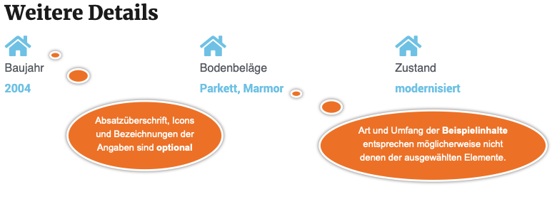
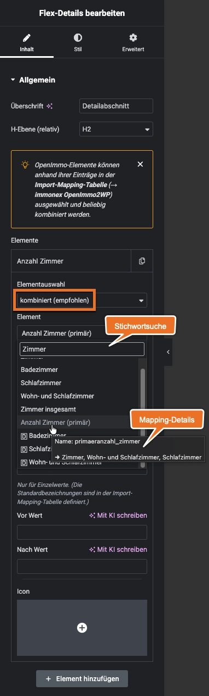
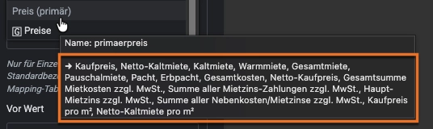
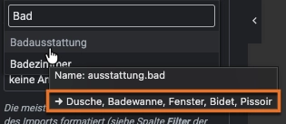

# Flex-Details

## Beispielansichten

### Layout mit Icons

### Kompakteres Alternativlayout

## Widget-Details

[Skin](/anpassung-erweiterung/skins)-Templates:  
`widgets/single-property/detail-list.twig` (Frontend)  
`widgets/single-property/detail-list-preview.php` (Editor-Vorschau)

---

Mit dem Flex-Details-Widget kann eine Liste **beliebiger Immobilien-Detaildaten** erstellt werden.

Der Listenumfang wird in Form von *Elementen* festgelegt, wobei ein Element hierbei nicht nur einen einzelnen Wert, sondern auch eine Gruppe von Angaben umfassen kann.

Grundlage für die Auswahl der Inhalte ist die [Mapping-Tabelle](https://docs.immonex.de/openimmo2wp/#/mapping/tabellen), die für den **OpenImmo-XML-basierten Import** mit [immonex OpenImmo2WP](https://plugins.inveris.de/wordpress-plugins/immonex-openimmo2wp) eingesetzt wird – konkret: alle Custom-Field-Einträge (`custom_field` in der Spalte *Type*).

### Kombinierte Elementauswahl

Nach dem Hinzufügen eines Elements ist die Suche in einer *kombinierten* Liste die gängigste (und vorausgewählte) Auswahlart für den zugehörigen Inhalt. Die hierin enthaltenen Optionen beziehen sich auf die Spalten *Name*, *Group* (Gruppe, 🄶 vor der Bezeichnung) und *Destination* (Zielfeld, 🄳) der Mapping-Tabelle.

?> Beim Darüberfahren mit dem Mauszeiger werden die relevanten *Mapping-Details* der jeweiligen Auswahloptionen angezeigt: Neben der Art sind das der Inhalt der der zugehörigen Spalte sowie – sofern vorhanden – die möglichen Werte, die hierzu in der Mapping-Tabelle hinterlegt sind.

Bestimmte auswählbare Elemente können **in der Tabelle** mehrfach mit unterschiedlichen Quellen- (*Source*) oder Zielangaben (*Destination*) vorhanden sein. Im Rahmen der Importverarbeitung wird bei mehreren Übereinstimmungen dieser Art (und identischem Zielfeld) entweder der Wert mit der höchsten Priorität oder eine Zeichenkette gespeichert, die alle *Matches* in kombinierter Form enthält.

Die konkreten Angaben pro Auswahloption werden im o. g. Mapping-Detail-Popup angezeigt.

Beispiel: *Preis (primär)*

Die primäre Preisangabe hängt in erster Linie von der Vermarktungsart (Verkauf, Vermietung ...) eines Objekts ab und kann daher **einen** von diversen Werten enthalten, die hierzu im OpenImmo-Standard – und dementsprechend auch in der Mapping-Tabelle – definiert sind:

Beispiel: *Badausstattung*

Hier ist die Kombination mehrerer Angaben möglich, beim Import könnte also bspw. „Dusche, Badewanne“ gespeichert werden.

Beispiel: Gruppenoption *🄶 Flächen*

Hiermit werden im Frontend alle Daten der betreffenden Immobilie angezeigt, bei denen in der Spalte ***Group*** der Schlüssel `flaechen` hinterlegt ist.

### Alternative Auswahlarten

**Alternativ** kann die Auswahl auch auf eine bestimmte Spalte beschränkt oder mittels eines benutzerdefinierten bzw. *regulären Ausdrucks* ([Regular Expression](https://de.wikipedia.org/wiki/Regul%C3%A4rer_Ausdruck)) erfolgen:

| Elementauswahl          | Tabellenspalte(n) |
| ----------------------- | ----------------- |
| Gruppe                  | *Group*           |
| Name                    | *Name*            |
| Quelle                  | *Source*          |
| Ziel (Custom Field)     | *Destination*     |
| Benutzerdefiniert/RegEx | *Group*, *Name*, *Source* |

Bei diesen Auswahlarten gibt es keine Detail-Popups, stattdessen werden die entsprechenden Mapping-Angaben (in eckigen Klammern) und mögliche Mehrfachzuordnungen (auszugsweise in runden Klammern) direkt angezeigt.

Neben den regulären Gruppen können mit *Wildcard-Optionen* – erkennbar am `*` – auch über den Namen gruppierte Angaben eingebunden werden. Analog zum Beispiel im vorherigen Abschnitt würde bspw. die Auswahl von `Flächen (alle) [flaechen.*]` das gleiche Ergebnis liefern.

Mit der Elementart *Ziel* können Daten auf Basis des *Custom Fields* eingebunden werden, in dem sie beim Import per Zuordnung über die Spalte ***Destination*** gespeichert werden.  
Beispiel: *Wohnfläche [_inx_living_area]*

Darüber hinaus können mit *benutzerdefinierten* Zeichenketten oder [regulären Ausdrücken (RegEx)](https://de.wikipedia.org/wiki/Regul%C3%A4rer_Ausdruck) auch beliebige Inhalte der Spalten ***Group***, ***Name*** und ***Source*** bei der Filterung der auszugebenden Objektdaten berücksichtigt werden. Ein RegEx-Ausdruck muss hierbei mit `/` beginnen und enden.

Handelt es sich bei den Elementwerten um reine Zahlen (z. B. Flächen- oder Preisangaben), URLs oder Mailadressen, die nicht bereits beim Import formatiert werden (Spalte ***Filter*** in der Mapping-Tabelle), kann unter *Format* eine passende Formatierungsart eingestellt werden. (Andernfalls wird der *Rohwert* eingebunden, was in den meisten Fällen unpassend ist.)

?> Eine ähnliche Art der Einbindung **ohne Listen-Layout** kann mittels **Elementor-Standard-Widgets** umgesetzt werden, die den [*Dynamic Tag* Template-Daten](/elementor-immobilien-dynamic-tags/template-daten) unterstützen.

## Siehe auch

- Dynamic Tag: [Template-Daten](/elementor-immobilien-dynamic-tags/template-daten)
- [Import von OpenImmo-Immobiliendaten in WordPress-Sites](https://docs.immonex.de/kickstart/#/schnellstart/import)
- [Mapping-Tabellen](https://docs.immonex.de/openimmo2wp/#/mapping/tabellen) (immonex OpenImmo2WP)

