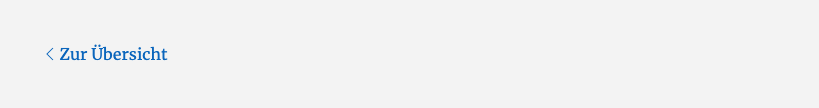

# Footer

## Beispielansicht

## Widget-Details

[Skin](/anpassung-erweiterung/skins)-Template (Parent Plugin): `single-property/footer.php`

---

Mit dem Footer-Widget kann eine einfache *Fußzeile* in die Immobilien-Detailseiten eingebunden werden, die einen Link zur Übersichtsseite (Listenansicht) enthält.

## Siehe auch

- Widget: [Standard-Header](standard-header)
- [Immobilien-Detailansicht](https://docs.immonex.de/kickstart/#/komponenten/detailansicht) (immonex Kickstart)

