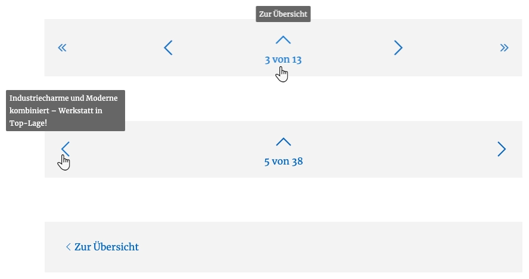
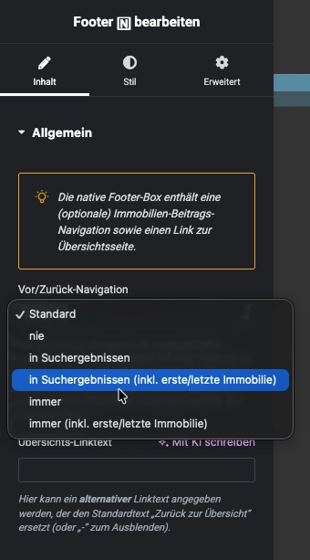

# Footer

## Beispielansicht

## Widget-Details

[Skin](/anpassung-erweiterung/skins)-Template (Parent Plugin): `single-property/footer.php`

---

Mit dem Footer-Widget kann eine einfache *Fußzeile* in die Immobilien-Detailseiten eingebunden werden, die einen Link zur Übersichtsseite (Listenansicht) sowie eine optionale Immobilien-Beitrags-Navigation (vorheriges/nächstes + erstes/letztes Angebot) enthält.

Die Einblendung der Beitragsnavigation kann davon abhängig gemacht werden, ob die in der Detailseite dargestellte Immobilie Teil eines Suchergebnisses ist. Falls ja, bezieht sich die Vor/Zurück-Navigation nur auf die Immobilien innerhalb dieses Suchergebnisses, andernfalls auf den kompletten Objektbestand.

In beiden Fällen kann zusätzlich eine erweiterte Navigation aktiviert werden, über die direkt zum ersten oder letzten Angebot gesprungen werden kann.

## Siehe auch

- Widget: [Standard-Header](standard-header)
- [Immobilien-Detailansicht](https://docs.immonex.de/kickstart/#/komponenten/detailansicht) (immonex Kickstart)

