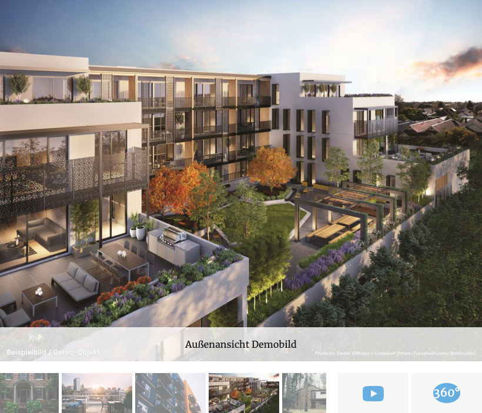
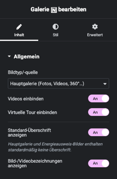

# Galerie

## Beispielansicht

## Widget-Details

[Skin](/anpassung-erweiterung/skins)-Template (Parent Plugin): `single-property/gallery.php`

---

Wie alle [nativen Widgets](einleitung?id=native-widgets) basiert auch die Galerie auf dem *Standard-Skin* des Kickstart-Basisplugins.

Neben statischen Bildern sind [Videos](videogalerie) und eine [360°-Tour](virtuelle-360-grad-tour) standardmäßig Teil der Galerie. Alternativ ist aber auch eine Deaktivierung und separate Einbindung mit den entsprechenden Widgets möglich.

Mit der gleichnamigen Option können der Typ bzw. die Quelle der einzubindenden Medien festgelegt werden:

- Hauptgalerie (Außen- und Innenansichten, Objekt-Detailfotos, Illustrationen, Videos, virtuelle Tour etc.)
- Grundrisse und Lagepläne
- Energieausweisbilder/-dokumente
- *Benutzerdefinierte Felder*

Bei Auswahl letzterer Option können in einem zusätzlichen Eingabefeld (kommagetrennt) die **Namen** der benutzerdefinierten Felder (*Custom Fields*) hinterlegt werden, die die IDs der einzubindenden Medienanhang-Beiträge – wiederum in Form kommagetrennter Listen – enthalten.

Alle Widget-Einstellungen entsprechen weitestgehend den [galeriebezogenen Attributen](https://docs.immonex.de/kickstart/#/komponenten/detailansicht?id=galerien) des Kickstart-Shortcodes für Immobilien-Detailseiten-Abschnitte, [`[inx-property-details]`](https://docs.immonex.de/kickstart/#/komponenten/detailansicht?id=detail-abschnitte-gruppierte-angaben).

?> Beim Einsatz von **Elementor Pro** können Galerie-Inhalte alternativ auch mit **Elementor-Standard-Widgets** eingebunden werden, die den [*Dynamic Tag* Galerie](../elementor-immobilien-dynamic-tags/galerie) unterstützen.

## Siehe auch

- Widget: [Basisgalerie](basisgalerie)
- Widget: [Videogalerie 🄽](videogalerie)
- Widget: [Virtuelle 360° Tour 🄽](virtuelle-360-grad-tour)
- Dynamic Tag: [Galerie](../elementor-immobilien-dynamic-tags/galerie)
- [Shortcode-Attribute mit Galeriebezug](https://docs.immonex.de/kickstart/#/komponenten/detailansicht?id=galerien) (`[inx-property-details]`)

