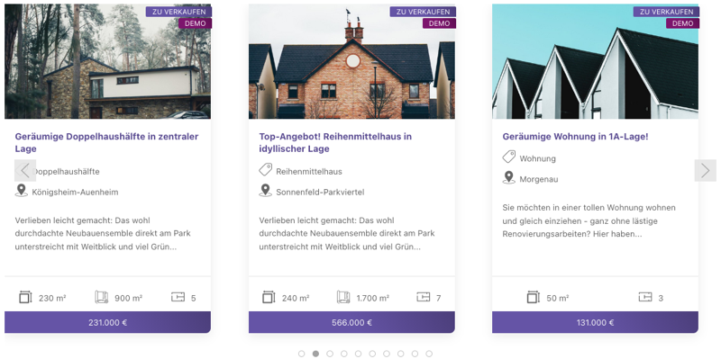
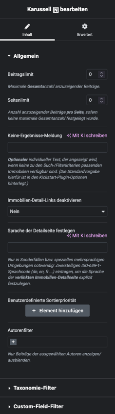

# Karussell

## Beispielansicht

?> Als Alternative zu diesem Widget können mit [Elementor Pro](https://be.elementor.com/visit/?bta=229006&nci=5657) können auch ganz [individuell gestaltete Listenansichten mittels Loop-Widgets](/elementor-pro/immobilien-loop-grid) erstellt werden.

## Widget-Details

[Skin](/anpassung-erweiterung/skins)-Templates (Parent Plugin):  
`property-list/slider.php`  
`property-list/list-item.php`

---

Das *Karussell-* bzw *Slider-Widget* ist eine alternative Variante der [Listenansicht](https://docs.immonex.de/kickstart/#/komponenten/liste)

Die Einstellungen sind identisch mit denen des [Grid-Listen-Widgets](liste-grid) und entsprechen damit ebenfalls weitestgehend den [Attributen](https://docs.immonex.de/kickstart/#/komponenten/liste?id=attribute) des entsprechenden Kickstart-Shortcodes `[inx-property-list]`.

---

### Siehe auch

- Widget: [Liste (Grid) 🄽](liste-grid)
- [Immobilienliste als Loop-Karussell (Elementor Pro)](/elementor-pro/immobilien-loop-grid)
- [Listenansicht](https://docs.immonex.de/kickstart/#/komponenten/liste) (immonex Kickstart)

