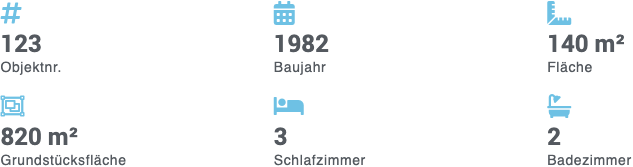
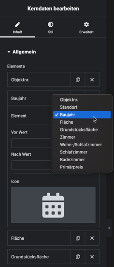
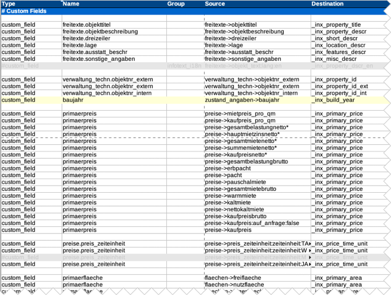

# Kerndaten

## Beispielansichten

### Kompaktes Standardlayout

### Alternativlayout

## Widget-Details

[Skin](/anpassung-erweiterung/skins)-Templates:  
`widgets/single-property/core-details.twig` (Frontend)  
`widgets/single-property/core-details-preview.php` (Editor-Vorschau)

---

In den Widget-Optionen können Umfang, Reihenfolge und Layout der *Immobilien-Kerndaten* flexibel angepasst werden – sowohl für die komplette Liste als auch für die einzelnen Elemente.

Die Zuordnung der Kerndaten erfolgt anhand der [Mapping-Tabelle](https://docs.immonex.de/openimmo2wp/#/mapping/tabellen), die für den [OpenImmo-XML-basierten Import](https://docs.immonex.de/kickstart/#/schnellstart/import) mit [immonex OpenImmo2WP](https://plugins.inveris.de/wordpress-plugins/immonex-openimmo2wp) eingesetzt wird. Bei den meisten hiervon enthält der Zielfeldname in der Spalte ***Destination*** das Präfix `_inx_primary_`.

## Siehe auch

- [Import von OpenImmo-Immobiliendaten in WordPress-Sites](https://docs.immonex.de/kickstart/#/schnellstart/import)
- [Mapping-Tabellen](https://docs.immonex.de/openimmo2wp/#/mapping/tabellen) (immonex OpenImmo2WP)

