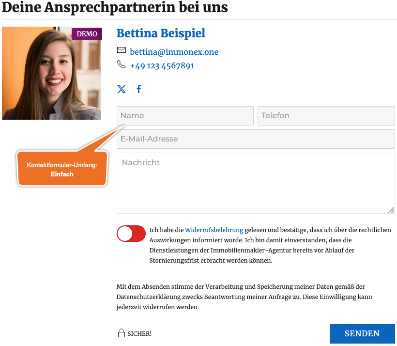

# Kontaktperson/-formular

## Beispielansicht

  
Kontakt-Abschnitt für Immobilien-Detailseiten

## Widget-Details

[Skin](/anpassung-erweiterung/skins)-Templates (Parent Plugin):  
`single-agent/index.php` (Vollansicht)  
`single-agent/widget.php` (Widget-Ansicht)  
`single-agent/default-contact-element-replacement.php` (Kontakt-Abschnitt für Immobilien-Detailseiten)

---

Mit diesem Widget können alle Informationen zu einer Kontaktperson (Immobilienmakler/in, *Agent*) inkl. Formular für die direkte Kontaktaufnahme eingebunden werden.

Der Umfang ist hierbei variabel und die Einbindung sowohl in Vorlageseiten/Templates von Immobilien-Detailseiten als auch in Seiten möglich, die sich bspw. nur auf einen bestimmten Ansprechpartner beziehen. Je nach Einsatzbereich kann in den Optionen eine der folgenden *Darstellungsarten* ausgewählt werden:

- Kontakt-Abschnitt (Standardauswahl für Immobilien-Detailseiten)
- Widget (kompaktere Ansicht für Seitenleisten etc.)
- Vollansicht (für dedizierte Ansprechpartner-Seiten)

Der Kontakt-Abschnitt und die kompaktere Widget-Ansicht enthalten im Normalfall alle Kontaktdaten inkl. Foto und Formular. Die Vollansicht umfasst darüber hinaus eine Liste zugehöriger Immobilien und einen Link zu den Agenturdetails.

Widget und Vollansicht bieten zudem die Möglichkeit, eine Kontaktperson explizit auszuwählen. Beim Kontakt-Abschnitt für die Immobilien-Detailseiten wird automatisch der zugehörige Ansprechpartner übernommen.

Soll hinsichtlich der anzuzeigenden Elemente **nicht** der jeweilige Standardumfang der gewählten Darstellungsart übernommen werden, kann via ***Kontakt-Elemente*** eine individuelle Auswahl getroffen werden.

Beim Kontaktformular kann zwischen einer einfachen (Name, Telefon, E-Mail-Adresse, Nachricht) und einer erweiterten Variante (inkl. Anrede und zusätzlichen Pflichtfeldern für Vor- und Nachname sowie die Adresse) gewählt werden. Bei Auswahl von *Standard* wird die entsprechende [Vorgabe der Kickstart-Team-Plugin-Optionen](https://docs.immonex.de/kickstart-team/#/schnellstart/einrichtung?id=kontaktformular) übernommen, was auch für diverse weitere Optionen mit dieser Auswahlmöglichkeit gilt.

## Siehe auch

- [Kontaktpersonen-Details](https://docs.immonex.de/kickstart-team/#/komponenten/kontaktpersonen-details) (immonex Kickstart Team)
- Plugin: [immonex Kickstart Team](https://de.wordpress.org/plugins/immonex-kickstart-team/) (→ [Dokumentation](https://docs.immonex.de/kickstart-team/))

