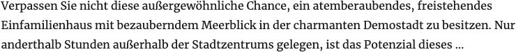
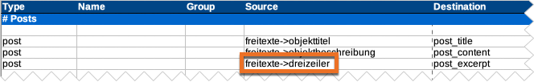

# Kurzbeschreibung

## Beispielansicht

## Widget-Details

[Skin](/anpassung-erweiterung/skins)-Templates:  
`widgets/single-property/short-desc.twig` (Frontend)  
`widgets/single-property/short-desc-preview.php` (Editor-Vorschau)

---

Die maximale Länge der **Kurzbeschreibung für die Immobilien-Detailansichten** kann in den Widget-Optionen eingestellt werden.

Die Kurzbeschreibung entspricht im Regelfall der via [Mapping-Tabelle](https://docs.immonex.de/openimmo2wp/#/mapping/tabellen) beim Import zugewiesenen OpenImmo-Angabe *Dreizeiler*. Wurde diese nicht übertragen, wird ein Textauszug anhand der primären Objektbeschreibung generiert.

## Siehe auch

- [Import von OpenImmo-Immobiliendaten in WordPress-Sites](https://docs.immonex.de/kickstart/#/schnellstart/import)
- [Mapping-Tabellen](https://docs.immonex.de/openimmo2wp/#/mapping/tabellen) (immonex OpenImmo2WP)

