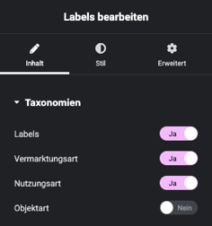
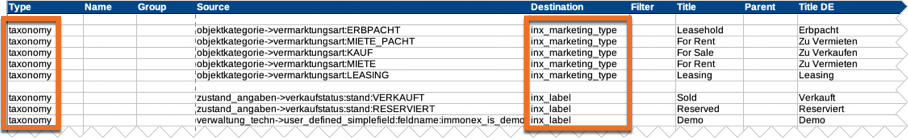

# Labels

## Beispielansicht

## Widget-Details

[Skin](/anpassung-erweiterung/skins)-Templates:  
`widgets/single-property/labels.twig` (Frontend)  
`widgets/single-property/labels-preview.php` (Editor-Vorschau)

---

Mit dem Labels-Widget können nicht nur die Begriffe (*Terms*) der gleichnamigen Taxonomie in der Immobilien-Detailseite angezeigt werden, sondern (optional) auch die der weiteren [Taxonomien des Kickstart-Basisplugins](https://docs.immonex.de/kickstart/#/beitragsarten-taxonomien) für die Objekt-, Nutzungs- und Vermarktungsart.

Die Zuweisung erfolgt anhand der Einträge des Typs `taxonomy` (Spalte ***Type***) in der [Mapping-Tabelle](https://docs.immonex.de/openimmo2wp/#/mapping/tabellen), die beim [Immobilien-Import mit immonex OpenImmo2WP](https://plugins.inveris.de/wordpress-plugins/immonex-openimmo2wp) zum Einsatz kommt.

Die Farben der Labels können unter ***immonex → Einstellungen → Allgemein → Farben*** angepasst werden. Alternativ kann auch eine einheitliche Farbe für **alle Labels** in den Elementor-Widget-Optionen ausgewählt werden.

## Siehe auch

- [Beitragsarten und Taxonomien](https://docs.immonex.de/kickstart/#/beitragsarten-taxonomien) (immonex Kickstart)
- [Import von OpenImmo-Immobiliendaten in WordPress-Sites](https://docs.immonex.de/kickstart/#/schnellstart/import)
- [Mapping-Tabellen](https://docs.immonex.de/openimmo2wp/#/mapping/tabellen) (immonex OpenImmo2WP)

