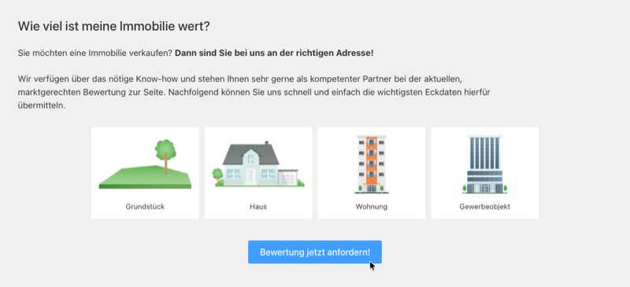
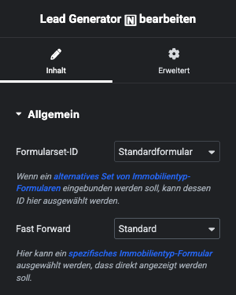

# Lead Generator

## Beispielansicht

## Widget-Details

---

Beim Einsatz des [Lead-Generator-Plugins](https://plugins.inveris.de/shop/immonex-lead-generator/) zur Generierung qualifizierter Verkäuferkontakte können mit diesem Widget die zugehörigen "Klick-Formulare" eingebunden werden, mit denen Eigentümer schnell und einfach die wichtigsten Eckdaten Ihrer Immobilien zwecks Wertermittlung übermitteln können.

Wurden mehrere [Formularsets](https://docs.immonex.de/lead-generator/#/formulare/editor?id=formularsets) angelegt, kann in den Widget-Optionen die entsprechende ID ausgewählt werden, sofern **nicht** das auf das Standard-Formularset zurückgegriffent werden soll.

Mit der Option ***Fast Forward*** kann zudem festgelegt werden, ob unmittelbar nach dem Laden der Komponente ein Sprung zu einem bestimmten *Immobilientyp-Formular* erfolgen soll.

## Siehe auch

- Plugin: [immonex Lead Generator](https://plugins.inveris.de/shop/immonex-lead-generator/) (→ [Dokumentation](https://docs.immonex.de/lead-generator/))

