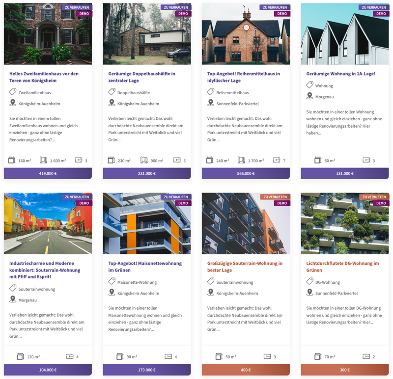
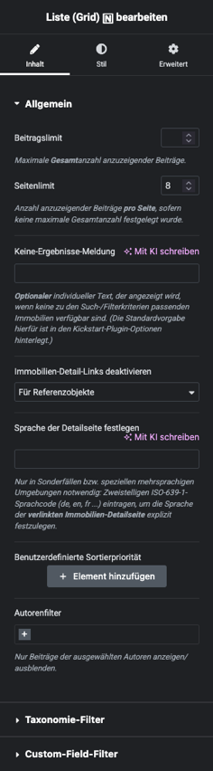

# Liste (Grid)

## Beispielansicht

?> Als Alternative zu diesem Widget können mit [Elementor Pro](https://be.elementor.com/visit/?bta=229006&nci=5657) können auch ganz [individuell gestaltete Listenansichten mittels Loop-Widgets](/elementor-pro/immobilien-loop-grid) erstellt werden.

## Widget-Details

[Skin](/anpassung-erweiterung/skins)-Templates (Parent Plugin):  
`property-list/properties.php`  
`property-list/list-item.php`

---

Mit dem Grid-Widget kann eine Immobilien-Listenansicht im "klassischen Rasterlayout" eingebunden werden. Je nach Einsatzbereich und Konfiguration kann diese durch zusätzliche Komponenten für die [Auswahl der Sortierung](filter-sortierung) und die [Seitennavigation](seitennavigation) ergänzt werden.

Die Widget-Einstellungen inkl. Filter- und Sortieroptionen entsprechen weitestgehend den [Attributen](https://docs.immonex.de/kickstart/#/komponenten/liste?id=attribute) des entsprechenden Kickstart-Shortcodes `[inx-property-list]`.

Ist ein [Suchformular](suchformular) in der gleichen Seite enthalten, erfolgt standardmäßig eine *dynamische Aktualisierung* der Listeninhalte bei Änderung der Suchkriterien. (Diese Funktion kann in den [Kickstart-Plugin-Optionen](https://docs.immonex.de/kickstart/#/schnellstart/einrichtung?id=dynamische-aktualisierung) deaktiviert werden kann.)

---

### Siehe auch

- Widget: [Suchformular 🄽](suchformular)
- Widget: [Filter/Sortierung 🄽](filter-sortierung)
- Widget: [Seitennavigation 🄽](seitennavigation)
- [Immobilienlisten mit Loop Grids (Elementor Pro)](/elementor-pro/immobilien-loop-grid)
- [Listenansicht](https://docs.immonex.de/kickstart/#/komponenten/liste) (immonex Kickstart)

