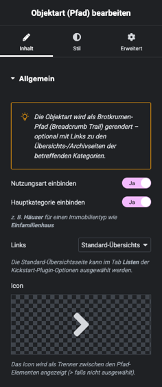
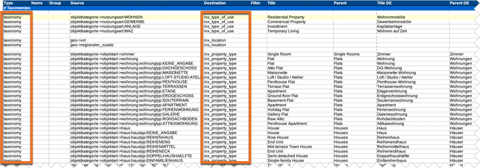

# Objektart (Pfad)

## Beispielansicht

## Widget-Details

[Skin](/anpassung-erweiterung/skins)-Templates:  
`widgets/single-property/property-type.twig` (Frontend)  
`widgets/single-property/property-type-preview.php` (Editor-Vorschau)

---

Die Objektart wird als *Brotkrumen-Pfad* (*Breadcrumb Trail*) gerendert – optional mit Links zu den Übersichts-/Archivseiten der betreffenden Kategorien.

Alternativ kann durch Ausblenden von Nutzungsart und Hauptkategorie auch nur die eigentliche Objektart (Unterkategorie) angezeigt werden.

Die Objektarten/-kategorien werden beim OpenImmo-Import in Form von *Terms* der *Taxonomien* `inx_type_of_use` (Nutzungsart) und `inx_property_type` (Objektart) zugewiesen. Diese sind in der Spalte ***Destination*** der Mapping-Tabelle hinterlegt.

## Siehe auch

- [Beitragsarten und Taxonomien](https://docs.immonex.de/kickstart/#/beitragsarten-taxonomien) (immonex Kickstart)
- [Import von OpenImmo-Immobiliendaten in WordPress-Sites](https://docs.immonex.de/kickstart/#/schnellstart/import)
- [Mapping-Tabellen](https://docs.immonex.de/openimmo2wp/#/mapping/tabellen) (immonex OpenImmo2WP)

