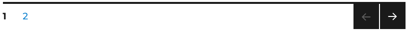

# Seitennavigation

## Beispielansicht

## Widget-Details

[Skin](/anpassung-erweiterung/skins)-Template (Parent Plugin): `property-list/pagination.php`

---

Die Seitennavigation (Paginierung) für Immobilienlisten wird im Regelfall unterhalb der zugehörigen [Grid-Listenansicht](liste-grid) eingebunden.

Für die Generierung der Ausgabe kommt die reguläre WordPress-Paginierungsfunktion ([get_the_posts_navigation](https://developer.wordpress.org/reference/functions/get_the_posts_pagination/)) zum Einsatz, die Optik entspricht daher – sofern vorhanden – den **Vorgaben des Themes**.

---

### Siehe auch

- Widget: [Liste (Grid) 🄽](liste-grid)
- Widget: [Filter/Sortierung 🄽](filter-sortierung)
- [Seitennavigation](https://docs.immonex.de/kickstart/#/komponenten/seitennavigation) (immonex Kickstart)

