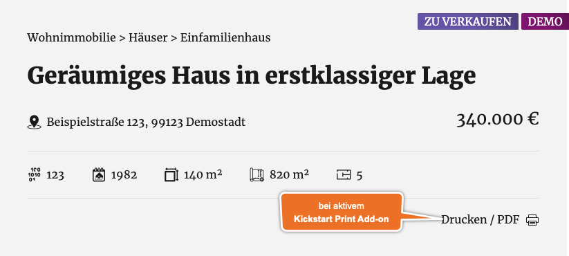

# Standard-Header

## Beispielansicht

## Widget-Details

[Skin](/anpassung-erweiterung/skins)-Template (Parent Plugin): `single-property/head.php`

---

Der auf dem *Standard-Skin* des Kickstart-Basisplugins basierende Header für [Immobilien-Detailansichten](https://docs.immonex.de/kickstart/#/komponenten/detailansicht) enthält neben der Bezeichnung die folgenden Angaben:

- Objektart
- Adresse oder nur PLZ + Ort (je nach Freigabe)
- Preis
- Kerndaten (Baujahr, Fläche, Zimmeranzahl etc.)
- Labels (z. B. Vermarktungsart)

Alle Elemente sind **optional** und können separat ein-/ausgeblendet und formatiert werden. (Die Reihenfolge kann nicht verändert werden.)

Die **Farben der Labels** können unter ***immonex → Einstellungen → Allgemein → Farben*** angepasst werden.

Der Link **Drucken / PDF** wird nur angezeigt, wenn das *Kickstart Print Add-on* installiert und die entsprechende Option unter ***immonex → Einstellungen → Print ADD-ON*** aktiviert ist.

?> Die o. g. Angaben können auch in Form separater Elemente (Widgets) eingebunden werden, wenn bspw. eine flexiblere Positionierung umgesetzt werden soll.

## Siehe auch

- [Immobilien-Detailansicht](https://docs.immonex.de/kickstart/#/komponenten/detailansicht) (immonex Kickstart)

