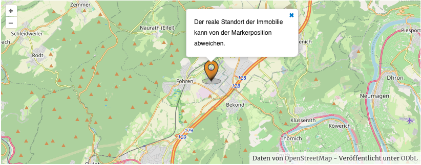
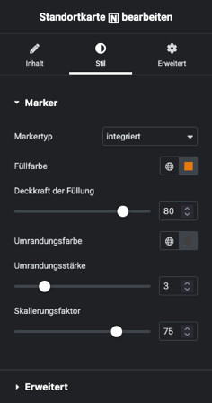
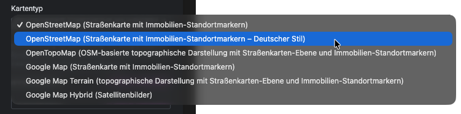

# Standortkarte

## Beispielansicht (OpenStreetMap)

## Widget-Details

[Skin](/anpassung-erweiterung/skins)-Template (Parent Plugin): `single-property/location-map.php`

---

Mit diesem Widget können [OpenStreetMap](https://www.openstreetmap.org/)- oder [Google-Maps](https://developers.google.com/maps?hl=de)-basierte Karten (inkl. Standortmarker) in unterschiedlichen Varianten in die Immobilien-Detailansicht eingebunden werden.

!> Voraussetzung für die Nutzung von Google-Maps-Karten ist ein passender [API-Schlüssel](https://docs.immonex.de/lead-generator/#/installation-einrichtung/google-api-key). Dieser wird normalerweise in den Kickstart-Plugin-Optionen hinterlegt, kann aber alternativ auch in der Widget-Konfiguration angegeben werden.

Größe und Optik des Standortmarkers können im Tab ***Stil*** der Widget-Optionen angepasst werden. Bei Auswahl des Markertyps *benutzerdefiniert* kann alternativ auch die URL einer individuellen Markergrafik angegeben werden.

Alle Widget-Einstellungen entsprechen weitestgehend den [kartenbezogenen Attributen](https://docs.immonex.de/kickstart/#/komponenten/detailansicht?id=standortkarte) des Kickstart-Shortcodes für Immobilien-Detailseiten-Abschnitte, [`[inx-property-details]`](https://docs.immonex.de/kickstart/#/komponenten/detailansicht?id=detail-abschnitte-gruppierte-angaben).

---

### Siehe auch

- [Shortcode-Attribute mit Kartenbezug](https://docs.immonex.de/kickstart/#/komponenten/detailansicht?id=standortkarte) (`[inx-property-details]`)

