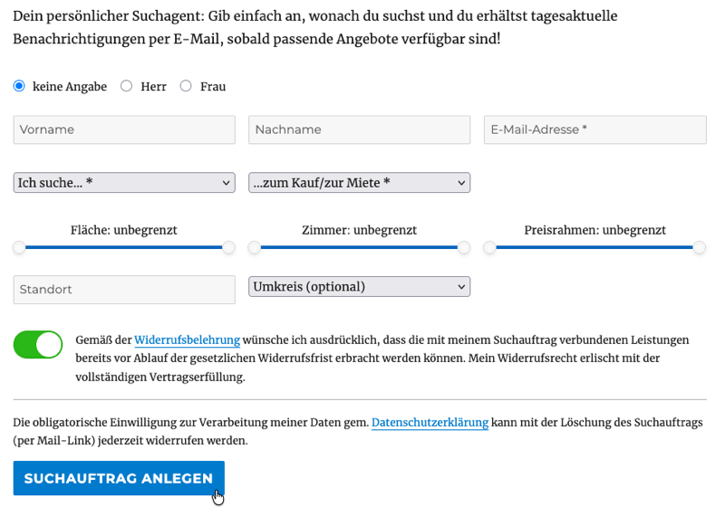
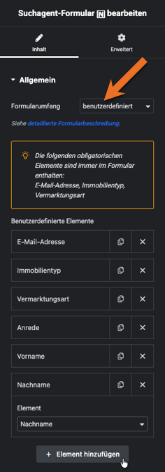

# Suchagent-Formular

## Beispielansicht

## Widget-Details

---

Wenn das [immonex Notify-Plugin](https://plugins.inveris.de/shop/immonex-notify/) für die **automatisierte E-Mail-Vermarktung** eingesetzt wird, kann mit diesem Widget ein Formular eingebunden werden, das Interessenten das Anlegen von *Suchaufträgen* mit ihren persönlichen Kriterien (Immobilienart, Lage, Größe, Preisrahmen etc.) ermöglicht. Bei Veröffentlichung passender Angebote werden dann automatisch entsprechende Benachrichtigungen versendet.

Neben den beiden gängigsten Varianten (*kompakt* und *vollständig*) ist auch ein *benutzerdefinierter* Formularumfang möglich. (Bestimmte obligatorische Elemente sind hierbei immer im Formular enthalten und die Reihenfolge der Ausgabe entspricht nicht zwingend der der Auswahl.)

## Siehe auch

- Plugin: [immonex Notify](https://plugins.inveris.de/shop/immonex-notify/) (→ [Dokumentation](https://docs.immonex.de/notify/))

