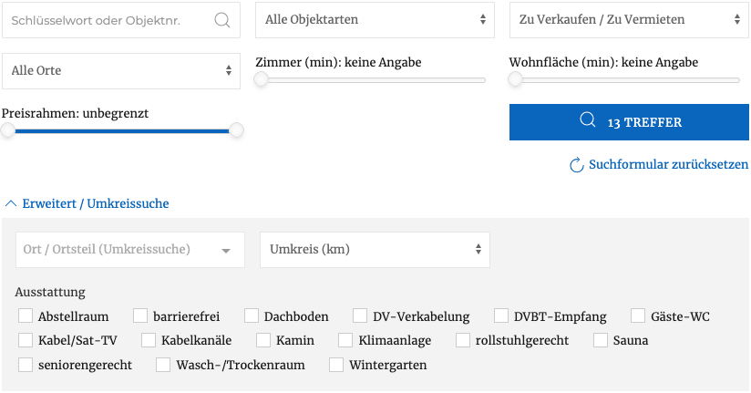
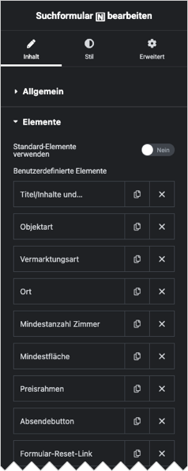

# Suchformular

## Beispielansicht (Standardumfang)

## Widget-Details

[Skin](/anpassung-erweiterung/skins)-Template (Parent Plugin): `property-search.php`

---

Mit diesem Widget kann ein Immobilien-Suchformular eingefügt werden – in den meisten Fällen in Kombination mit einem [Listenelement](liste-grid).

Der Umfang ist frei konfigurierbar, wobei die Standardvorgabe (siehe Screenshot) die gängigen Auswahlmöglichkeiten inkl. *erweiterter Suchoptionen* (einblendbar) mit Umkreissuche und Auswahl von Ausstattungsmerkmalen umfasst. 

Die Widget-Einstellungen entsprechen weitestgehend den [Attributen](https://docs.immonex.de/kickstart/#/komponenten/suchformular?id=attribute) des entsprechenden Kickstart-Shortcodes `[inx-search-form]`.

## Siehe auch

- Widget: [Liste (Grid) 🄽](liste-grid)
- [Suchformular](https://docs.immonex.de/kickstart/#/komponenten/suchformular) (immonex Kickstart)

