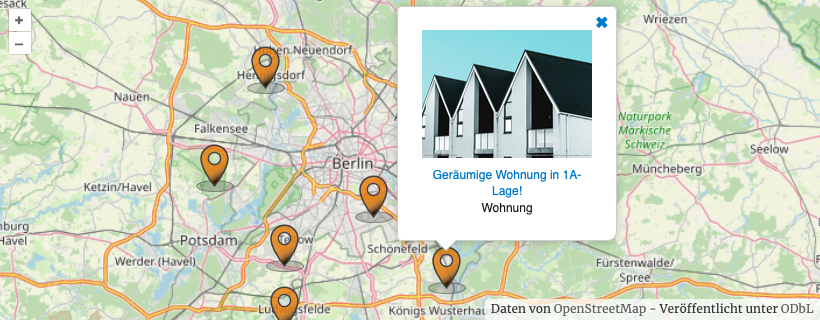
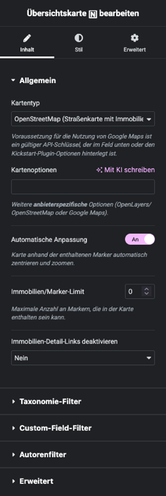

# Übersichtskarte <!-- {docsify-ignore-all} -->

## Beispielansicht (OpenStreetMap)

## Widget-Details

[Skin](/anpassung-erweiterung/skins)-Template (Parent Plugin): `property-list/map.php`

---

Mit diesem Widget können [OpenStreetMap](https://www.openstreetmap.org/)- oder [Google-Maps](https://developers.google.com/maps?hl=de)-basierte Karten mit Standortmarkern in unterschiedlichen Varianten in die Immobilien-Detailansicht eingebunden werden.

!> Voraussetzung für die Nutzung von Google-Maps-Karten ist ein passender [API-Schlüssel](https://docs.immonex.de/lead-generator/#/installation-einrichtung/google-api-key). Dieser wird normalerweise in den Kickstart-Plugin-Optionen hinterlegt, kann aber alternativ auch in der Widget-Konfiguration angegeben werden.

Größe und Optik des Standortmarkers können im Tab ***Stil*** der Widget-Optionen angepasst werden. Bei Auswahl des Markertyps *benutzerdefiniert* kann alternativ auch die URL einer individuellen Markergrafik angegeben werden.

Alle Widget-Einstellungen entsprechen weitestgehend den [Attributen](https://docs.immonex.de/kickstart/#/komponenten/karte?id=shortcode) des Kickstart-Karten-Shortcodes `[inx-property-map]`.

Ist ein [Suchformular](suchformular) in der gleichen Seite enthalten, erfolgt bei Änderung der Suchkriterien standardmäßig eine *dynamische Aktualisierung* der Kartenmarker. (Diese Funktion kann in den [Kickstart-Plugin-Optionen](https://docs.immonex.de/kickstart/#/schnellstart/einrichtung?id=dynamische-aktualisierung) deaktiviert werden kann.)

## Siehe auch

- [Übersichtskarte](https://docs.immonex.de/kickstart/#/komponenten/karte) (immonex Kickstart)

