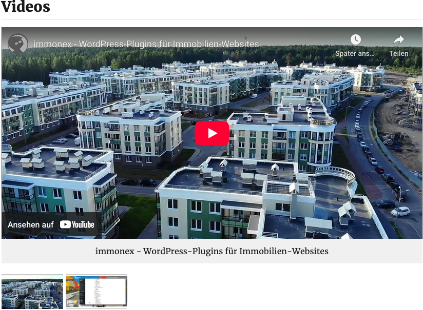

# Videogalerie

## Beispielansicht

## Widget-Details

[Skin](/anpassung-erweiterung/skins)-Template (Parent Plugin): `single-property/video-gallery.php`

---

Die Videogalerie ist eine Variante des *nativen* [Galerie-Widgets](galerie), bei dem der Umfang der einzubindenden Inhalte auf Videos beschränkt ist (sowohl lokal als auch extern via YouTube oder Vimeo).

### Siehe auch

- Widget: [Galerie 🄽](Galerie)

