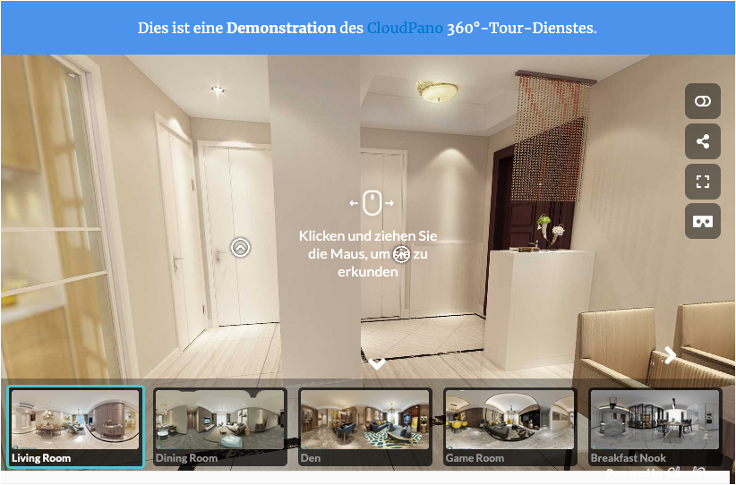

# Virtuelle 360° Tour

## Beispielansicht

## Widget-Details

[Skin](/anpassung-erweiterung/skins)-Template (Parent Plugin): `single-property/virtual-tour.php`

---

Mit diesem Widget können 360°-Ansichten und virtuelle Touren externer Anbieter (z. B. [Ogulo](https://ogulo.com/), [immoviewer](https://immoviewer.de/), [Matterport](https://matterport.com/de), [CloudPano](https://de.cloudpano.com/) etc.) **separat** in die Immobilien-Detailansicht eingebunden werden.

?> 360°-Touren sind – sofern nicht deaktiviert – auch Teil der *nativen* [Galerie](galerie).

## Siehe auch

- Widget: [Galerie 🄽](Galerie)
- [Immobilien-Detailansicht](https://docs.immonex.de/kickstart/#/komponenten/detailansicht) (immonex Kickstart)

