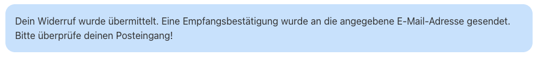

# Widerrufsformular-Bestätigungsmeldung

## Beispielansicht

## Widget-Details

---

Mit dem in Kickstart integrierten [Widerrufs-Workflow](https://docs.immonex.de/kickstart/#/komponenten/widerrufsformular) kann Verbrauchern der einfache Widerruf von Verträgen nach § 356a BGB ermöglicht werden, die über die Immobilienmakler-Website abgeschlossen wurden („Widerrufsbutton“).

Mit diesem Widget kann der in den Kickstart-Plugin-Optionen unter ***immonex → Einstellungen → Widerruf → Formular/Allgemein*** hinterlegte Bestätigungstext eingebunden werden, sofern die ID der betr. Seite im gleichen Tab als Weiterleitungsziel nach erfolgreichem Versand der [Formulardaten](widerrufsformular) definiert wurde.

## Siehe auch

- Widget: [Widerrufsformular 🄽](widerrufsformular)
- [Widerrufsformular](https://docs.immonex.de/kickstart/#/komponenten/widerrufsformular) (immonex Kickstart)

