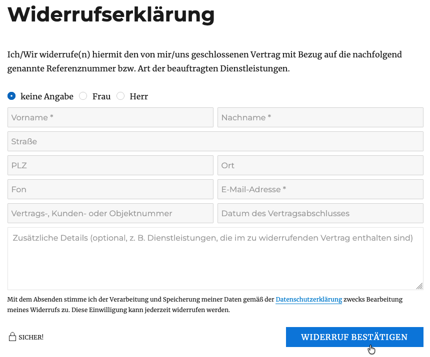
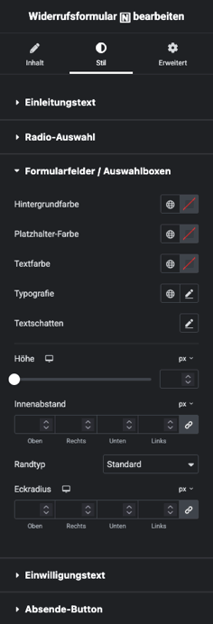

# Widerrufsformular

## Beispielansicht

## Widget-Details

[Skin](/anpassung-erweiterung/skins)-Template (Parent Plugin): `withdrawal-form.php`

---

Seit dem 19.06.2026 muss in Maklerwebsites, die Immobilienangebote enthalten, ein digitaler Widerrufsprozess für hierüber geschlossene Verträge nach § 356a BGB angeboten werden („Widerrufsbutton“).

Mit dem in Kickstart integrierten [Widerrufs-Workflow](https://docs.immonex.de/kickstart/#/komponenten/widerrufsformular) werden Immobilienmakler dabei unterstützt, die gesetzlichen Anforderungen zu erfüllen.

Dieses Widget dient der Einbindung des zugehörigen Formulars, über das Verbraucher ihre Widerrufserklärungen inkl. aller für die Zuordnung der jeweiligen Verträge benötigten Angaben übermitteln können.

?> Voraussetzung hierfür ist die Aktivierung der Funktion unter ***immonex → Einstellungen → Widerruf → Formular/Allgemein.*** (Hier können auch die zugehörigen Frontend- und Mail-Inhalte bearbeitet werden.)

← Umfang und Reihenfolge der Formularelemente sind in diesem Fall fest vorgegeben, die Optik kann aber individuell angepasst werden.

## Siehe auch

- [Widget: Widerrufsformular-Bestätigungsmeldung 🄽](widerrufsformular-bestaetigungsmeldung)
- [Widerrufsformular](https://docs.immonex.de/kickstart/#/komponenten/widerrufsformular) (immonex Kickstart)

