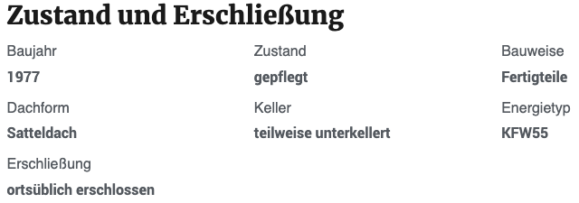
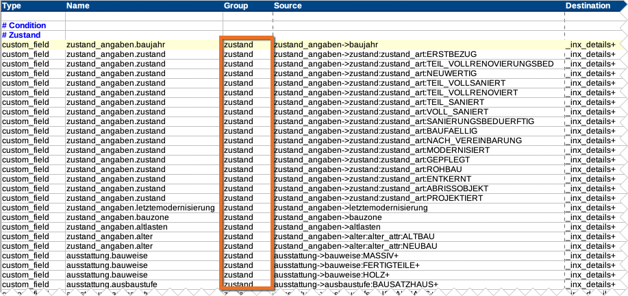

# Zustand & Erschließung

## Beispielansicht

## Widget-Details

[Skin](/anpassung-erweiterung/skins)-Templates:  
`widgets/single-property/condition.twig` (Frontend)  
`widgets/single-property/condition-preview.php` (Editor-Vorschau)

---

Die Auswahl der Angaben zu Zustand und Erschließung der Immobilie, die mit diesem Widget eingebunden werden, erfolgt anhand der *Mapping-Gruppe* `zustand`.

Hierzu gehören standardmäßig auch Merkmale wie Bauweise, Dachform und die Art der Unterkellerung.

## Siehe auch

- [Import von OpenImmo-Immobiliendaten in WordPress-Sites](https://docs.immonex.de/kickstart/#/schnellstart/import)
- [Mapping-Tabellen](https://docs.immonex.de/openimmo2wp/#/mapping/tabellen) (immonex OpenImmo2WP)

