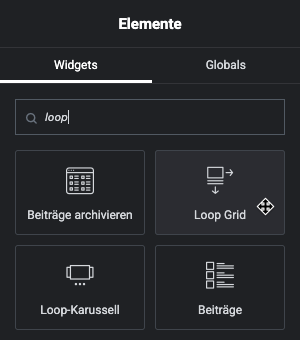
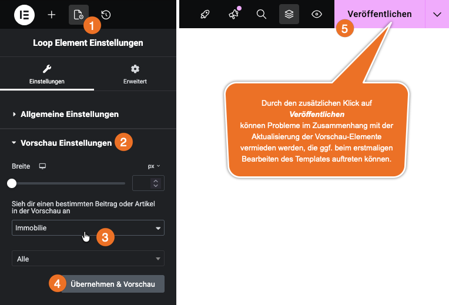
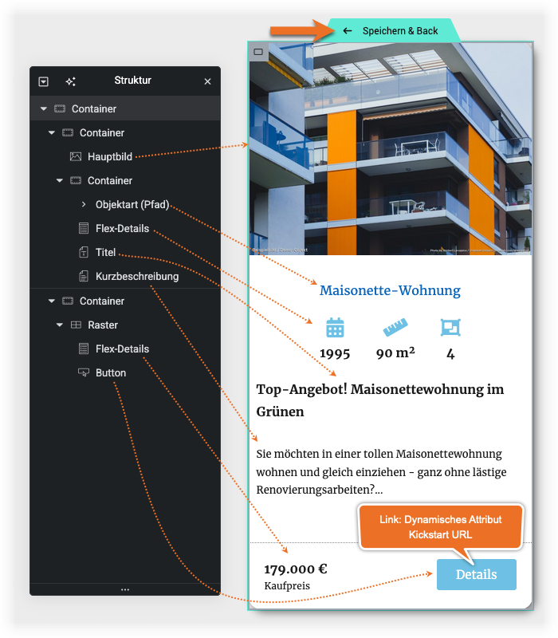
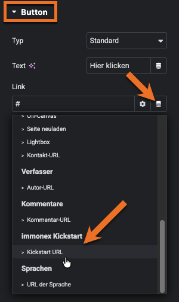
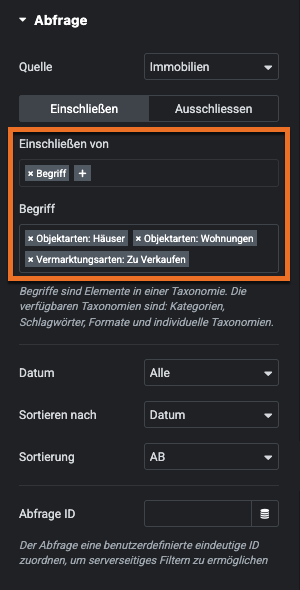
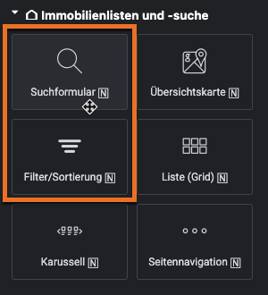
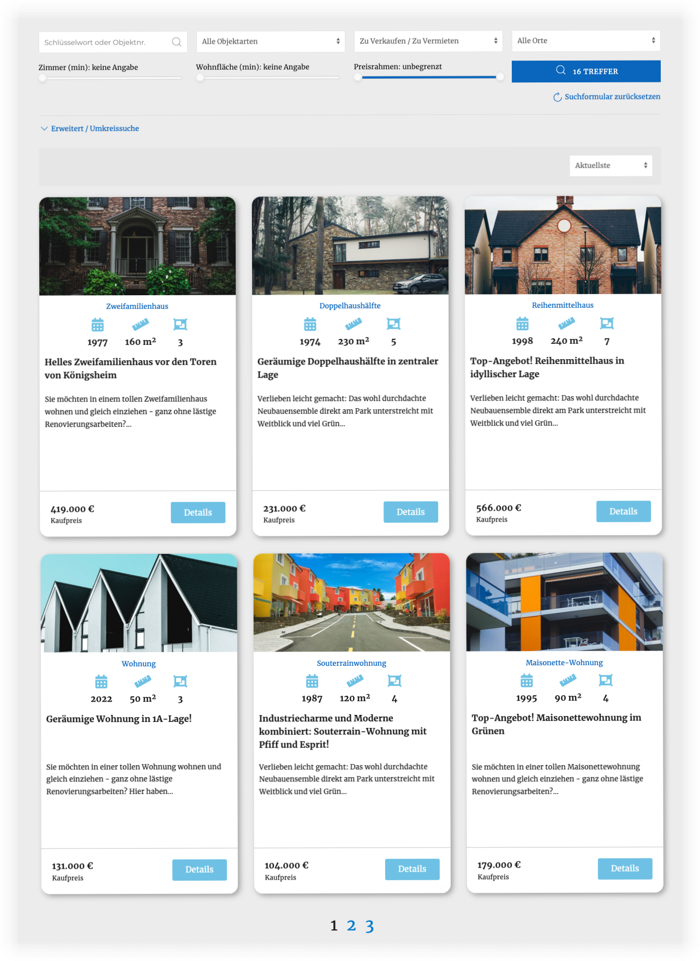

# Loop Grid und Loop-Karussell für Immobilien

Wird [Elementor Pro](https://be.elementor.com/visit/?bta=229006&nci=5657) eingesetzt, können – als Alternative zu den *nativen* Kickstart-Widgets [Liste (Grid)](/elementor-immobilien-widgets/liste-grid) und [Karussell](/elementor-immobilien-widgets/karussell) – auch ganz individuell gestaltete Listenansichten mittels *Loop-Widgets* erstellt werden:

- [Loop Grid](https://elementor.com/help/loop-grid/) (Immobilienangebote in einem Raster)
- [Loop-Karussell / Loop Carousel](https://elementor.com/help/loop-carousel/) (*Immobilien-Slider*)

Die Erstellung läuft bei beiden Varianten gleich ab und wir nachfolgend am Beispiel einer einfachen Immobilien-Übersichtsseite auf Basis eines *Loop Grids* im Schnelldurchgang beschrieben.

?> **Vor** dem Anlegen der Seite sollten bereits Immobilien vorhanden sein, die für die Vorschau im Elementor-Editor verwendet werden können. Ist das noch nicht der Fall, können unter [immonex.dev](https://immonex.dev/) passende **OpenImmo-Demo-Inhalte** sowie [OpenImmo2WP](https://docs.immonex.de/openimmo2wp/) zum Importieren selbiger kostenlos heruntergeladen werden!

1. ***Seiten → Seite hinzufügen***, Titel eingeben (z. B. "Aktuelle Immobilienangebote"), anschließend *Mit Elementor bearbeiten* klicken
2. Widget *Loop Grid* suchen und einfügen

3. im Abschnitt ***Abfrage*** der Widget-Optionen als *Quelle* **Immobilien** auswählen
4. zurück zum Abschnitt ***Layout*** wechseln, *Template erstellen* im Abschnitt wählen und im folgenden Dialog das Speichern der Änderungen bestätigen (Hiermit wird eine Vorlage für ein *einzelnes Listenelement* erstellt, die anschließend für alle Immobilien innerhalb des Rasters übernommen wird.)
5. in den ***Vorschau-Einstellungen*** des Loop-Elements die Beitragsart *Immobilie* auswählen, danach auf *Übernehmen & Vorschau* **und** *Veröffentlichen* klicken (Letzteres um Vorschau-Probleme zu umgehen, die in bestimmten Umgebungen auftreten können.)

6. gewünschte [Kickstart-Widgets](/elementor-immobilien-widgets/uebersicht?id=immobilien-detailansicht) aus dem Abschnitt *Immobiliendetails* zum Template hinzufügen, konfigurieren und gestalten, anschließend "*Speichern & Back*"

  
Beispiel für die Gestaltung eines Loop-Grid-Templates mit Kickstart-Widgets

?> Als *Ziel-URL* von Objekt-Detailseiten-Links sollte immer das dynamische Attribut (*Dynamic Tag*) *Kickstart URL* ausgewählt werden, mit dem eine passende *Backlink-URL* angehangen wird.

7. Layoutoptionen (Spaltenanzahl, Elemente pro Seite) ggf. anpassen und die **Seitennummerierung** im gleichnamigen Abschnitt aktivieren
8. **optional**: Auswahl und Sortierung der Immobilien anpassen

Soll auf der Seite eine **feste Auswahl** von Immobilien angezeigt werden, können Art, Status und Sortierung der Objekte in den Optionen des Loop-Grid-Elements unter ***Abfrage*** angepasst werden.

Die jeweiligen Taxonomie-Begriffe können hierbei beliebig kombiniert und sowohl als Ein- als auch als Ausschlusskriterien definiert werden.

Der Beispiel-Screenshot zeigt die Auswahl für zu verkaufende Häuser und Wohnungen.

9. **optional**: Suchformular und Auswahl der Sortierung ergänzen

**Alternativ** zur fixen Auswahl kann das Loop-Element auch mit einem darüber platzierten [Immobilien-Suchformular](/elementor-immobilien-widgets/suchformular) und/oder einer [Sortierungsauswahl](/elementor-immobilien-widgets/filter-sortierung) kombiniert werden.

!> Bei einer Kickstart-Version <= 1.3.4 muss in den Einstellungen des Suchformular-Widgets ggf. unter ***Alternative Ergebnisseite*** die Option *aktuelle Seite (explizit)* ausgewählt werden, sofern die es sich bei der gerade bearbeiteten Seite **nicht** um die [primäre Übersichtsseite](https://docs.immonex.de/kickstart/#/schnellstart/einrichtung?id=immobilien-%c3%9cbersicht) für die Immobilien-Angebote handelt.

10. Seite **veröffentlichen** 😉

Das Ergebnis könnte dann beispielsweise so aussehen:

---

### Siehe auch

- Widget: [Liste (Grid) 🄽](/elementor-immobilien-widgets/liste-grid)
- Widget: [Karussell 🄽](/elementor-immobilien-widgets/karussell)
- [Listenansicht](https://docs.immonex.de/kickstart/#/komponenten/liste) (immonex Kickstart)
