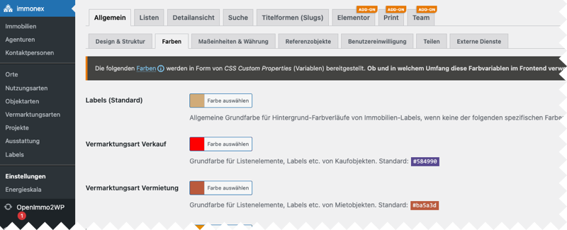

# Installation

## Automatisch

immonex Kickstart Elementor ist im offiziellen [WordPress-Plugin-Verzeichnis](https://de.wordpress.org/plugins/immonex-kickstart-elementor/) verfügbar und kann über die Suche unter ***Plugins → Installieren*** automatisiert heruntergeladen und installiert werden.

## Manuell

Das Plugin kann alternativ auch via ***Plugins → Installieren → Plugin hochladen*** als ZIP-Datei manuell installiert oder aktualisiert werden (bspw. eine noch **nicht** im WP-Plugin-Verzeichnis verfügbare Beta-Version, die von [immonex.dev](https://immonex.dev/) heruntergeladen wurde).

Im Anschluss an den Upload und die Installation muss das Plugin noch per Klick auf den angezeigten Button oder den entsprechenden Link in der Plugin-Liste **aktiviert** werden.

## Einrichtung

Mit Ausnahme der **optionalen** [Auswahl eines alternativen Skins](/anpassung-erweiterung/skins?id=auswahl) unter ***immonex → Einstellungen → Elementor ADD-ON*** weist das Add-on keine dedizierten Optionen auf.

Umfang und Optik der hiermit eingebundenen Inhaltselemente werden größtenteils direkt im Elementor-Editor konfiguriert.

Grundlage für die Darstellung bilden die *Skins* und Design/Layout-Optionen der Plugins, dir für das eigentliche *Rendering* der jeweiligen Frontend-Komponenten verantwortlich sind, z. B.:

- ***immonex → Einstellungen → Allgemein → Design & Struktur, Farben ...*** (Kickstart-Basisplugin)
- ***immonex → Energieskala*** (Energy Scale Pro)
- ***Immobilien-Leads → Einstellungen*** (Lead Generator)
- ***Suchaufträge → Einstellungen*** (Notify)

## Hier geht's weiter &#8811; <!-- {docsify-ignore} -->

- [Schnellstart](schnellstart)