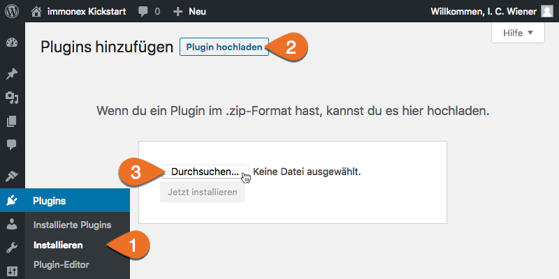
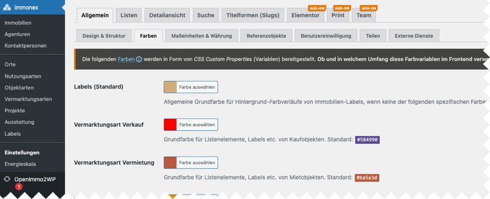

# Installation

## Automatisch

immonex Kickstart for Elementor ist im offiziellen [WordPress-Plugin-Verzeichnis](https://de.wordpress.org/plugins/immonex-kickstart-for-elementor/) verfügbar und kann über die Suche unter ***Plugins → Installieren*** automatisiert heruntergeladen und installiert werden.

## Manuell

Das Plugin kann alternativ auch via ***Plugins → Installieren → Plugin hochladen*** als ZIP-Datei manuell installiert oder aktualisiert werden (bspw. eine noch **nicht** im WP-Plugin-Verzeichnis verfügbare Beta-Version, die von [immonex.dev](https://immonex.dev/) heruntergeladen wurde).

Im Anschluss an den Upload und die Installation muss das Plugin noch per Klick auf den angezeigten Button oder den entsprechenden Link in der Plugin-Liste **aktiviert** werden.

## Einrichtung

?> Umfang und Optik der Inhaltselemente können weitestgehend direkt im Elementor-Editor konfiguriert werden.

Der Add-on-Optionstab unter ***immonex → Einstellungen → Elementor ADD-ON*** bietet daher nur die (optionale) Möglichkeit, ein alternatives [Skin](/anpassung-erweiterung/skins) auszuwählen.

Unabhängig von den Einstellungen im Elementor-Editor und dem Add-on-Skin bilden die jeweiligen **pluginspezifischen** Skins und Design/Layout-Optionen die Grundlage für die Darstellung. Diese werden nachfolgend auch als *globale Optionen* bezeichnet und beziehen sich auf die immonex-Plugins, die für das eigentliche *Rendering* der zugehörigen Frontend-Komponenten verantwortlich sind:

- Kickstart-Basisplugin (***immonex → Einstellungen → Allgemein → Design & Struktur, Farben ...***)
- Energy Scale Pro (***immonex → Energieskala***)
- Lead Generator (***Immobilien-Leads → Einstellungen***)
- Notify (***Suchaufträge → Einstellungen***)

## Hier geht's weiter &#8811; <!-- {docsify-ignore} -->

- [Schnellstart](schnellstart)