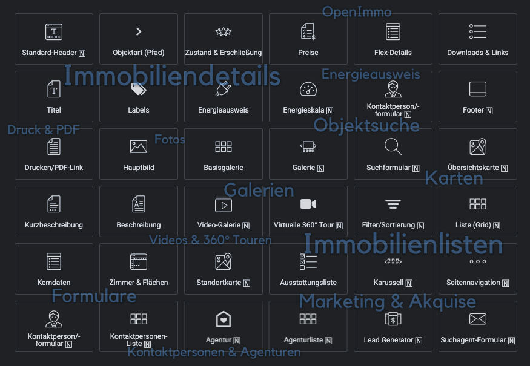

# Über dieses Plugin <!-- {docsify-ignore-all} -->

**immonex Kickstart Elementor** ermöglicht als *Add-on-Plugin* für [immonex Kickstart](https://de.wordpress.org/plugins/immonex-kickstart/)¹ die schnelle und einfache Einbindung der hierüber bereitgestellten **Frontend-Komponenten für die Präsentation von Immobilien-Angeboten** in *Elementor-Templates*, z. B.

- Immobilienlisten
- Objektdetails (Beschreibungstexte, Flächen, Ausstattung, Preise etc.)
- Immobilien-Suchformular
- Standortkarten
- Mediengalerien (Objektfotos, Grundrisse/Lagepläne, Videos, 360°-Ansichten, virtuelle Touren ...)

Ebenfalls unterstützt werden Inhaltselemente weiterer immonex-Plugins wie ...

- Objektbezogene Kontaktdaten und Anfrageformulare
- Ansprechpartner- und Agenturlisten
- Energieskalen (Visualisierung der Effizienzklasse gem. Energieausweis)
- Lead Generator (Wertermittlungs-Anfrageformulare zur Generierung qualifizierter Verkäuferkontakte)
- Suchagent (Formular zum Anlegen von Suchaufträgen mit automatisierter Mail-Benachrichtigung)
- uvm.

**Elementor** ist ein beliebter *Page Builder* bzw. *Website Builder* für WordPress. Das Kickstart-Elementor-Add-on kann sowohl in Kombination mit der kostenfreien [Open-Source-](https://de.wordpress.org/plugins/elementor/) als auch mit der erweiterten [Pro-Variante](https://be.elementor.com/visit/?bta=229006&nci=5657) eingesetzt werden.

?> Alle [Widgets](/elementor-immobilien-widgets/uebersicht) können in vollem Umfang mit der kostenfreien Elementor-Variante genutzt werden. Elementor Pro wird nur für die Verwendung der [Dynamic Tags](/elementor-immobilien-dynamic-tags/uebersicht) benötigt.

## Kernfunktionen

- 35+ spezielle [Elementor-Immobilien-Widgets](/elementor-immobilien-widgets/uebersicht) mit umfangreichen Konfigurationsmöglichkeiten
- [Dynamic Tags](/elementor-immobilien-dynamic-tags/uebersicht) zur Einbindung von Immobiliendaten und -bildern mit Elementor-Standard-Widgets
- Verwendung regulärer Seiten als Vorlagen mit der kostenlosen Version von Elementor
- Unterstützung mehrsprachiger Websites ([WPML](https://wpml.org/de/) und [Polylang](https://de.wordpress.org/plugins/polylang/)/[Polylang Pro](https://polylang.pro/))

## Zielgruppen dieser Dokumentation

- Web-/Werbeagenturen mit Kunden aus der Immobilienbranche
- WordPress-Entwickler und -Integratoren
- technikaffine Immobilienmakler/innen

## Hier geht's weiter &#8811;

- [Systemanforderungen](/grundlagen/systemanforderungen)
- [Schnellstart](/grundlagen/schnellstart)

---

¹ [immonex Kickstart](https://de.wordpress.org/plugins/immonex-kickstart/) ist ein quelloffenes und lizenzkostenfreies [Immobilien-Plugin](https://github.com/immonex/kickstart/), das [WordPress-Websites](https://de.wordpress.org/) auf Basis beliebiger Themes um Komponenten für die professionelle Präsentation von **Immobilien-Angeboten** erweitert: Listen- und Detailansichten, Objektsuche, Standortkarten etc. (Weitere Komponenten und Funktionen können in Form von *Add-ons* ergänzt werden.)

Der Fokus liegt hierbei auf Immobiliendaten, die per Maklersoftware erfasst/verwaltet und via [OpenImmo®-Schnittstelle](https://docs.immonex.de/kickstart/grundlagen/openimmo-import) importiert werden. 

